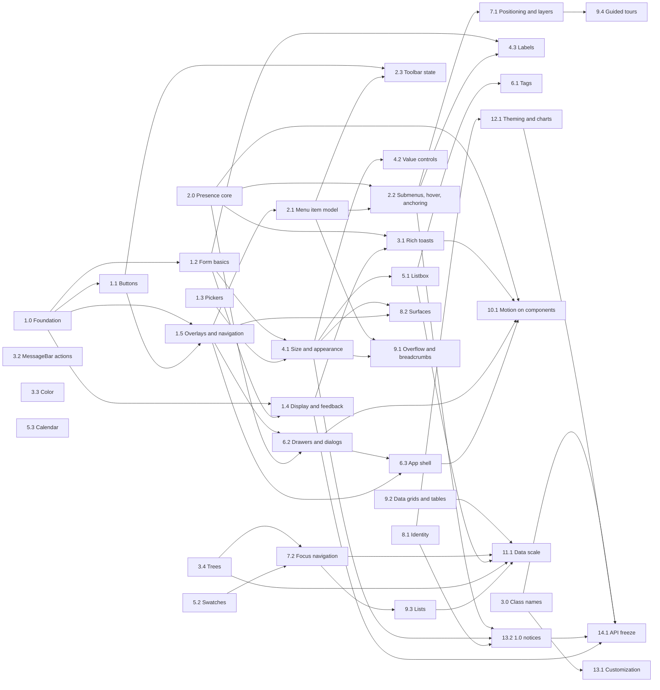

# WaveUI roadmap: Fluent UI v9 parity

- **Status:** plan of record from 0.6.0 to 1.0.0. Written 2026-09-25 on `feat/fluent-parity`; revised the same day after three reviews (conventions, sequencing, Phase 1 against the code). Review points that were not applied are listed with reasons in the Phase 1 spec, §8. **Phase 1 (0.6.0) is implemented** and merged to `main`, unreleased (CHANGELOG `## [0.6.0] - Unreleased`). **Phase 2 (0.7.0) is implemented** on `feat/fluent-parity-phase-2` and unreleased (CHANGELOG `## [0.7.0] - Unreleased`; design spec [`docs/superpowers/specs/2026-09-26-fluent-parity-phase-2-design.md`](superpowers/specs/2026-09-26-fluent-parity-phase-2-design.md)). This line marks each phase released when its version ships.
- **Baseline:** `@mortenbrudvik/waveui` 0.5.0 (merged to `main`, unreleased) against `@fluentui/react-components` 9.74.9.
- **Inputs:** the verified comparison report [`docs/research/fluent-ui-v9-comparison.md`](research/fluent-ui-v9-comparison.md) and its gap list (475 gaps: 7 high, 135 medium, 333 low). Every gap id below (`buttons-3`, `menu-10`, …) is an id of that list.
- **Phase 1 design:** [`docs/superpowers/specs/2026-09-25-fluent-parity-phase-1-design.md`](superpowers/specs/2026-09-25-fluent-parity-phase-1-design.md) (0.6.0, implemented; unreleased).
- **Phase 2 design:** [`docs/superpowers/specs/2026-09-26-fluent-parity-phase-2-design.md`](superpowers/specs/2026-09-26-fluent-parity-phase-2-design.md) (0.7.0, implemented on `feat/fluent-parity-phase-2`; unreleased). Every later phase gets its own design spec before work starts (see [Process](#3-process-per-release)).

How to read this document:
- **Phases** are releases (minor versions after 0.5.0, then 1.0.0). A phase has a theme, epics, entry and exit criteria.
- **Epics** group items that belong together. Each has a goal.
- **Items** are the unit of planning. Each item lists the gaps it closes, a public API sketch that follows the repository conventions (`CLAUDE.md`, C-* rules), acceptance criteria, the WaveUI strengths it must keep, a size and its dependencies. Item ids carry their phase (`P3-05` is the fifth item of Phase 3); an item that moved between phases in a revision got a new id.
  - **Closes:** the gap ids the item resolves. Every high and medium gap is closed by exactly one item; low gaps are closed by an item when they are part of the same work, otherwise they are in the [backlog](#8-backlog-low-impact-gaps).
  - **Mitigates:** a gap the item improves without closing it (closed later by the named item).
  - **Guards:** the WaveUI strengths of [§1.2](#12-what-waveui-keeps-its-own-strengths) the item touches, each kept by a named test that must stay green (and, where the item changes the area, a new test).
  - **Depends on:** the items whose output this item uses; [§6](#6-dependency-graph-epics) is generated from these fields.
  - **Size:** S = contained change to one or two components; M = a new sub-component, a shared module, or a feature across several components; L = a new subsystem, or a change that touches many components.
- API sketches are sketches. The phase design spec fixes names, types, defaults and behaviour, and may change a sketch when the code says otherwise; the change is then recorded in that spec's rulings.

---

## 1. Goals and non-goals

### 1.1 What parity means for WaveUI

**Capability parity with Fluent UI React v9 stable, not an API clone.** A team that could build a screen with `@fluentui/react-components` can build it with WaveUI, with the same or better accessibility, without hand-rolled workarounds. Concretely:

1. Every **stable** Fluent v9 component and sub-component has a WaveUI counterpart, or a documented WaveUI way to reach the same result (for example List `selectable` for a standalone listbox). Each one is scheduled in an item (§7); none is left to the backlog.
2. Every **high** and **medium** gap of the report is closed by 1.0, with one exception: `foundation-46` (chart components) is resolved by a documented strategy (P12-04), because building charts is a non-goal (§1.3).
3. Fluent's **compat** pickers (DatePicker, Calendar, TimePicker) are matched where WaveUI ships a first-class equivalent.
4. **Names.** Fluent's prop and part names are the default when they fit WaveUI's conventions (`disabledFocusable`, `iconPosition`, `validationState`, `modalType`, `selectTabOnFocus`, and the state name `checkedValues`). Where a Fluent name clashes with a convention, the convention wins: state uses `value`/`onValueChange`, `checked`/`onCheckedChange`, `open`/`onOpenChange` (C-NAMING), so Tooltip's controlled state is `open`, not Fluent's `visible`; a state callback is named after its state (`checkedValues` → `onCheckedValuesChange`, not Fluent's `onCheckedValueChange`); a new value of an existing concept reuses the existing union (Tree uses `SelectionMode`'s `'multiple'`, not Fluent's `'multiselect'`); and a Fluent prefix that 0.5 deprecated does not come back (Nav `currentCategory`, not `selectedCategoryValue`). **Callbacks:** a state or value callback receives the value first and any extra data in a second `details` argument (`onOpenChange(open, details?)`, `onColumnResize(width, { columnId })`); `details` added to an existing callback is typed optional through 0.x and required from 1.0. A DOM-style `on<Event>` handler that mirrors a native event (`onClick`, List `onAction`) receives the event, like `onClick`.
5. **Behaviour** follows the WAI-ARIA Authoring Practices first and Fluent second. Where the two differ, WaveUI keeps the APG behaviour and documents the difference (see [Intentional differences](#83-intentional-differences-no-change-planned)).

### 1.2 What WaveUI keeps (its own strengths)

These come from section 6 of the report. Parity work must not regress them: an item that touches one of these names it in a **Guards:** bullet, and its phase spec names the test that keeps it.

- **Components Fluent does not ship:** Pagination, Stepper, Stack/Flex/Grid, TabList panels (`TabList.Panel`/`TabList.Panels`), `Drawer.Trigger`/`Drawer.Close` for uncontrolled drawers, first-class DatePicker and TimePicker, public `useIsOverflowing` and `useControllable`, control-level `error` on Input, Select and Textarea.
- **Native forms everywhere:** hidden inputs with `name`/`form`/`required` and form reset on every value control and picker; a required `Field` blocks submission natively; Combobox and TagPicker filter as you type and announce "No matches"; the SearchBox clear button is a real tab stop; SpinButton follows APG (`largeStep` = 10 steps); Rating has 24px targets, RTL keys, `disabled`/`required`, fractional RatingDisplay.
- **Accessibility defaults:** severity is spoken by MessageBar and Toast; live regions need no provider; Toaster timers pause on hover, focus, blur and hidden tabs, toasts stay reachable over modals and move out of a Drawer's way; Accordion triggers live in headings with labelled panels; Tag dismiss buttons are named after their tag; Persona is announced once; Avatar detects image failures before hydration; Nav is a real `<nav>` with lists and disabled items; Carousel has full APG rotation control and starts paused under reduced motion; development warnings for unnamed controls, duplicate values and misplaced parts.
- **Overlays:** the dismiss-layer stack (Escape routed by focus, nested portals count as inside); named portal layers plus nesting depth; Tooltip text in the server HTML; Popover keeps the trigger's Tab order and names itself; Dialog `finalFocusRef` and a documented focus-return chain; `inert` isolation instead of `aria-modal`, so toasts stay announced.
- **Buttons, data and layout:** five sizes on every button; fully typed polymorphic `as`; `ToggleButton.onPressedChange`; SplitButton routes props to the right half; Toolbar works over any focusable descendant; DataGrid on a native `<table role="grid">` with grouped headers, automatic cell focus targets, `aria-multiselectable` and per-row selection names; Table `striped` and a focusable scroll region; Tree `*` key and `current`; Card's two selection patterns; Overflow handles reordering.
- **Foundation:** no runtime styles (no CSP nonce, no SSR style extraction); direction resolved per element (LTR islands in RTL pages); WCAG contrast asserted for every token pair in all three themes; `composeEventHandlers` lets consumers cancel the internal handler; three runtime dependencies (`@floating-ui/react-dom`, `clsx`, `tailwind-merge`).

### 1.3 Non-goals

- **Preview-only Fluent packages:** MenuGrid (`react-menu-grid-preview`), the motion components package (Collapse, Fade, Scale, Slide, Stagger: `react-motion-components-preview`) and the headless components (`react-headless-components-preview`). WaveUI ships its own presence core (P2-00, 0.7.0) and component motion (Phase 10), and revisits the rest only if Fluent stabilises them.
- **Griffel or any CSS-in-JS runtime.** WaveUI stays on Tailwind CSS 4 and a precompiled stylesheet.
- **v8/v0 migration shims.** WaveUI has no older API to bridge; Stack, Flex and Grid already cover the StackShim/FlexShim/GridShim use cases.
- **Bundling an icon set.** Icon slots accept any node; the guide keeps recommending `@fluentui/react-icons`.
- **Building charts.** Phase 12 ships a strategy (tokens and a guide for pairing an existing chart library), not chart components.
- **`targetDocument` and ShadowRoot mount nodes** (iframes, child windows, web components): deferred until there is demand (report section 7, "Candidates to defer").
- **Exact pixel parity** with Fluent's themes, and Fluent's `_unstable` recomposition hooks as-is. WaveUI exposes its own stable customization surface instead (stable class names in P3-00, structural slots and contexts in Phase 13).

---

## 2. Principles

1. **Conventions.** Every API follows `CLAUDE.md` (C-REF, C-COMPOSE, C-CLASS, C-TOKENS, C-RADIUS, C-LOGICAL, C-FOCUS, C-MOTION, C-DISABLED, C-NAMING, C-CONTEXT/C-MEMO/C-IDS, C-SLOTS, C-BUTTON-TYPE, C-NATIVE, C-ROUTING, C-FORMS, C-POPUPS, C-COMPOUND/C-PURE, the polymorphic rules, C-HOOKS, C-DEV, C-DOCS, C-STORIES) and the 0.5 rulings R1–R15 of `docs/superpowers/specs/2026-09-23-review-fixes-design.md`. New compound parts get flat names (`MenuItemCheckbox === Menu.ItemCheckbox`); new state is exposed as `data-*` attributes (enumerated ones always rendered with the resolved value, boolean ones present or absent; Phase 1 spec D22); new built-in strings are `<thing>Label`/`labels` props (R7) and appear in the README "Built-in text" table; a slot that replaces a default glyph follows one rule per kind (optional indicator, required indicator, status icon; Phase 1 spec D21); shared unions live in `src/lib/types.ts` and new props reuse them (`SelectionMode`, `LabelPosition`, `ModalType`, `CoreSize`) instead of introducing another spelling.
2. **Backward compatibility until 1.0.** As in 0.5: nothing public is removed; a renamed prop or value keeps the old name as a deprecated alias (`resolveDeprecatedProp`/`warnDeprecated`, warn once in development); a type may widen but never narrow. A change of behaviour, DOM structure or types that is not a rename is listed under "Changed" in the CHANGELOG with what to do. A value whose *meaning* changes (Badge `important`) or a default that changes (TimePicker `hourCycle`) is announced in a minor and changed only in 1.0; P13-03 owns the announcements and development warnings for everything 1.0 changes. Adding a member to a public interface that consumers implement (a controller type) is called out in the CHANGELOG "Types" section. A new parameter of an existing callback prop is optional through 0.x (code that calls the prop keeps compiling) and becomes required in 1.0.
3. **Accessibility bar.** WCAG 2.2 AA, the APG pattern of the widget, axe clean in unit tests (open states included) and in every story (the stories gate), forced colors (every state indicator visible), `prefers-reduced-motion` (C-MOTION), 24×24px targets, no information by color alone, logical properties and RTL keyboard behaviour through `getArrowIntent`, localizable built-in text, focus never lost to `<body>` (C-DISABLED, `usePreserveFocus`).
4. **Testing bar.** Test-driven: a failing test first for every behaviour. Per component: `testSystemProps`; a StrictMode "callback fires once" test for stateful features; an RTL test for anything directional; an SSR test (`renderToString` plus hydration without warnings) for anything that renders on the server or starts open; open-state axe, dismissal and focus-return tests for popups; `expectTypeOf`/`@ts-expect-error` type tests (checked by `tsconfig.dev.json`) for new props and unions; cross-component behaviour in `src/__tests__/integration.test.tsx`; clean output (no act() warnings, every `[WaveUI]` warning asserted). The conventions gate and the stories axe gate stay green.
5. **Docs with the code.** Component and prop JSDoc (C-DOCS) with `@default`/`@deprecated`; a story per new feature (C-STORIES); README usage notes, keyboard table and built-in text table; a CHANGELOG section per release (`## [x.y.0] - Unreleased` above the previous one, with Added, Changed, Deprecated, Fixed); `CLAUDE.md` only when a convention changes; the guide (`docs/WAVE-UI-GUIDE.md`) for new patterns.
6. **Bundle size.** Every module stays tree-shakeable (the `verify-dist` probe keeps importing only `Button` and must not pull in Dialog; new probes are added for subsystems such as motion and virtualization). No new runtime dependency without the maintainer's approval; new subsystems are opt-in modules a component imports only when the feature is used. Each release notes the size change of `dist/styles.css` and of the Button-only and full-import probes in its CHANGELOG.
7. **One spec per phase.** A phase starts only when its design spec (API, behaviour, files, tests, package ownership, rulings) is written and approved, like `2026-09-25-fluent-parity-phase-1-design.md` for 0.6.0.

---

## 3. Process per release

- **Entry criteria (every phase):** the previous phase is merged to `main` with a green final gate; this phase's design spec is written, reviewed and approved; open questions of the spec are answered by the maintainer.
- **Exit criteria (every phase):** every item's acceptance criteria are met and covered by tests; the full gate passes (`npm run typecheck`, `npm run lint`, `npm run format:check`, `npm test`, `npm run build`, `node scripts/verify-dist.mjs --final`, `npm run check:package`, `npm run test:pack`, `npm run build-storybook`); the CHANGELOG section is complete (Added, Changed, Deprecated); README, guide and `CLAUDE.md` are updated; the size report is in the CHANGELOG; no conventions-gate exception was added without a written reason.
- **Execution** follows the 0.5 model: a foundation package first, then component packages with disjoint file ownership in parallel, then INTEGRATION (barrels, cross-component tests, `verify-dist` flat names), then DOCS, then the final gate. A parallel package tests only against the foundation and its own files; a case that needs two parallel packages at once is an INTEGRATION test. A shared type whose widening breaks a module (a `Record<Union, …>` map) is widened by the package that owns that module. Agents never run git write commands; the lead commits per package.

---

## 4. Release overview

| Phase | Version | Theme | Items | Gaps closed (H / M / L) |
|---|---|---|---|---|
| 1 | 0.6.0 | Quick wins that need no new subsystem | 26 (P1-00 … P1-25) | 0 / 34 / 14 |
| 2 | 0.7.0 | Menus and commands; the presence core | 9 (P2-00 … P2-08) | 3 / 9 / 17 |
| 3 | 0.8.0 | Notifications, color and trees; stable class names | 8 (P3-00 … P3-07) | 4 / 6 / 10 |
| 4 | 0.9.0 | Form controls: size, appearance, values and labels | 4 | 0 / 15 / 19 |
| 5 | 0.10.0 | Pickers: multi-select, filtering, listbox, swatches, calendar | 5 | 0 / 8 / 20 |
| 6 | 0.11.0 | Tags, drawers and the app shell | 9 | 0 / 18 / 22 |
| 7 | 0.12.0 | Overlay and focus primitives made public | 3 | 0 / 5 / 17 |
| 8 | 0.13.0 | Identity, cards, tabs and carousel | 7 | 0 / 14 / 21 |
| 9 | 0.14.0 | Collections, data grids and guided tours | 8 | 0 / 12 / 31 |
| 10 | 0.15.0 | Motion on components (larger project) | 2 | 0 / 1 / 11 |
| 11 | 0.16.0 | Tables and lists at data scale (larger project) | 4 | 0 / 7 / 7 |
| 12 | 0.17.0 | Theming API and charts strategy (larger project) | 4 | 0 / 3 (1 by strategy) / 8 |
| 13 | 0.18.0 | Customization surface and 1.0 notices (larger project) | 3 | 0 / 1 / 12 |
| 14 | 1.0.0 | API freeze | 6 | 0 / 2 / 2 |
| — | backlog | Low-impact gaps not tied to an item | — | 0 / 0 / 122 |
| | | **Total** | **98** | **7 / 135 (1 by strategy) / 333** |

"By strategy" is `foundation-46` (chart components): P12-04 resolves it with a documented strategy, not with components (§1.1 goal 2). All seven high gaps ship by 0.8.0: the menu items and submenus in 0.7.0, rich toasts, ColorArea, ColorSlider and tree multi-select in 0.8.0.

Minor versions may ship backlog items at any time when a package touches the component anyway; the CHANGELOG then lists the gap id.

---

## 5. Phases

### Phase 1 — 0.6.0: quick wins

**Theme.** Small, contained changes with high user value that need no new subsystem: the report's section 7 "Quick wins", checked against the gap list and the code. The detailed design (exact APIs, behaviour, files, tests, packages and rulings) is [`2026-09-25-fluent-parity-phase-1-design.md`](superpowers/specs/2026-09-25-fluent-parity-phase-1-design.md); the entries below are its summary, and the spec wins where they differ.

**Entry:** 0.5.0 merged to `main`; the Phase 1 spec approved. **Exit:** the process exit criteria, plus the CHANGELOG "## [0.6.0] - Unreleased" section above 0.5.0 with the Badge `important` deprecation notice.

#### Epic 1.0 — Shared foundation

Goal: the small shared pieces the Phase 1 items build on, landed first so component packages can run in parallel.

- **P1-00 Foundation for Phase 1.**
  - **Closes:** none (enabling item).
  - **API sketch:** `src/lib/types.ts`: `IconPosition = 'before' | 'after'`, `ValidationState = 'none' | 'error' | 'warning' | 'success'`, `LabelPosition = 'before' | 'after' | 'above' | 'below'` (components take subsets through `Extract<>`), `OpenChangeDetails<R> = { reason: R; event: Event }`, `ModalOpenChangeReason`, `ModalType = 'modal' | 'alert'`. (`BadgeColor` is widened by P1-13 together with Badge's color map.) `FieldContextValue` gains optional `validationState` and `validationMessageId`, and `renderWithFieldContext` renders a validation message in any state. `useRovingTabIndex` keeps items marked `data-disabled-focusable` in the arrow-key order (native `disabled` and `data-roving-disabled` still win). `focusableDisabledProps(disabled, { reachable: true })` in `src/lib/aria.ts` adds that marker. `tokens.test.ts` asserts the progress fills (`success`, `error`, `severe`) at 3:1 against `track` and the Field message colors at 4.5:1 on `background` and `card`.
  - **Acceptance:** types exported through `export type * from './lib/types'`; roving, Field context and harness tests green; the library and dev programs type-check; no behaviour change for existing consumers.
  - **Size:** S. **Depends on:** none.

#### Epic 1.1 — Buttons and links

Goal: the button family and Link reach Fluent's icon placement and focusable-disabled capabilities, and a Link without `href` is always operable.

- **P1-01 `iconPosition` on the button family.**
  - **Closes:** `buttons-2` (M).
  - **API sketch:** `iconPosition?: IconPosition` (default `'before'`) on Button, ToggleButton, CompoundButton and SplitButton (not MenuButton, whose end holds the menu indicator, as in Fluent).
  - **Acceptance:** `'after'` renders the decorative icon after the label in DOM order (mirrors in RTL); ignored for icon-only buttons; type tests.
  - **Size:** S. **Depends on:** P1-00.
- **P1-02 Typed `icon` on CompoundButton.**
  - **Closes:** `buttons-6` (M).
  - **API sketch:** `CompoundButtonOwnProps.icon?: Slot<'span'>`, `iconPosition`, `disabledFocusable`; a 40px icon box (32px small, 24px extra-small) beside the two text lines.
  - **Acceptance:** icon beside the text column, start-aligned text; an icon-only CompoundButton renders no text wrapper and has exactly the sizing and name warning of an icon-only Button.
  - **Size:** S. **Depends on:** P1-01, P1-04.
- **P1-03 SplitButton `icon`, `iconPosition`, `menuIcon`.**
  - **Closes:** `buttons-13` (M).
  - **API sketch:** `icon`/`iconPosition` for the primary half; `menuIcon?: Slot<'span'>` replaces the chevron. The menu half always shows an indicator: unlike `MenuButton.menuIcon`, a value that renders nothing keeps the chevron (with a development warning).
  - **Acceptance:** icon-only SplitButton named through `primaryActionButtonProps['aria-label']`; custom chevron rendered decoratively; `menuIcon={false}` tested next to MenuButton's opposite behaviour.
  - **Guards:** SplitButton routes props to the right half (the 0.5 routing tests stay unchanged).
  - **Size:** S. **Depends on:** P1-01, P1-04.
- **P1-04 `disabledFocusable` on the button family and Link; reachable in Toolbar.**
  - **Closes:** `buttons-3` (M), `buttons-17` (L), `buttons-21` (L).
  - **API sketch:** `disabledFocusable?: boolean` on Button, CompoundButton, ToggleButton, MenuButton, SplitButton (both halves) and Link: `aria-disabled="true"`, `data-disabled`, `data-disabled-focusable`, stays in the tab order, activation prevented; wins over `disabled`. ToggleButton shows the disabled pressed look. Toolbar keeps such items in its arrow-key order.
  - **Acceptance:** Tab reaches it; click, Enter and Space do nothing (no submit, no `onClick`); Tooltip still shows on focus; Toolbar arrows land on it; Menu.Trigger does not open from it (P1-23, integration test).
  - **Guards:** Toolbar works over any focusable descendant; five sizes on every button; the typed polymorphic `as` (0.5 tests unchanged).
  - **Size:** M. **Depends on:** P1-00, P1-05.
- **P1-05 Link (and Button `as="a"`) without `href` is operable.**
  - **Closes:** `buttons-15` (M), `buttons-5` (L).
  - **API sketch:** no new prop. A shared `Button.semantics.ts` module (Button's 0.5 activation logic) serves Button and Link. An intrinsic `<a>` without `href`, or a non-interactive intrinsic `as` (`span`, `div`), gets `role="button"`, `tabIndex={0}` and Enter/Space activation (defaults the consumer may override). Link adopts Button's disabled semantics (click stopped, Enter/Space blocked, `role="button"` without `href`).
  - **Acceptance:** `<Link onClick>` is a named, focusable button; `<Link href>` unchanged; both behaviour changes (operable anchors, disabled Link) listed in the CHANGELOG.
  - **Size:** M. **Depends on:** none.

#### Epic 1.2 — Form basics

Goal: Field reaches Fluent's validation and layout model; choice controls take rich labels and label positions; Slider and RatingDisplay show what users expect.

- **P1-06 Field `validationState`, `validationMessage`, icons, hint with message, horizontal orientation.**
  - **Closes:** `form-basic-1` (M), `form-basic-3` (M), `form-basic-5` (M), `field-1` (M), `field-4` (M), `form-basic-2` (L), `field-2` (L), `field-3` (L).
  - **API sketch:** `validationState?: ValidationState`, `validationMessage?: ReactNode`, `validationMessageIcon?: Slot<'span'>` (status-icon rule: `null` shows none), `orientation?: Orientation` (default `'vertical'`); `error` stays as the shorthand for an error message. ColorPicker's hex input reads the new message id too.
  - **Acceptance:** error and warning messages are `role="alert"`, only error sets `aria-invalid`; the hint stays visible with a message (behaviour change); horizontal puts the label in a start column; state icons per state; `data-validation-state` and `data-orientation` always rendered; axe per state.
  - **Guards:** a required `Field` blocks submission natively; control-level `error` on Input, Select and Textarea (shown next to a Field warning).
  - **Size:** M. **Depends on:** P1-00.
- **P1-07 Rich labels for Checkbox, Switch and Radio; `labelPosition` for Checkbox and Switch.**
  - **Closes:** `form-basic-16` (M), `form-basic-19` (M), `form-basic-22` (M), `form-basic-17` (L), `form-basic-25` (L).
  - **API sketch:** `label?: ReactNode` on Checkbox, Switch and `RadioGroup.Item`; `labelPosition?: CheckboxLabelPosition` (`'before' | 'after'`) and `SwitchLabelPosition` (`'before' | 'after' | 'above'`), both `Extract<LabelPosition, …>`. Radio's label position (`'below'`) stays in the backlog (`form-basic-20`).
  - **Acceptance:** a label with a Link names the control, the link does not toggle it; DOM order follows the visual order; dropped `children` warn in development.
  - **Guards:** hidden inputs and form reset of the three controls.
  - **Size:** S. **Depends on:** P1-00.
- **P1-08 `disabledFocusable` on Switch and Checkbox; `aria-disabled` routed to the control.**
  - **Closes:** `form-basic-24` (L).
  - **API sketch:** `disabledFocusable?: boolean`; a consumer `aria-disabled` goes to the `role="switch"`/`role="checkbox"` button (C-ROUTING).
  - **Acceptance:** focusable, not toggleable, not submitted; axe clean.
  - **Size:** S. **Depends on:** P1-00.
- **P1-09 Slider progress fill.**
  - **Closes:** `form-basic-29` (M).
  - **API sketch:** no new prop; the rail from `min` to the thumb is drawn in `primary` (WebKit gradient driven by `--wave-slider-progress`, Firefox `::-moz-range-progress`). Slider gains an internal ref, an always-attached change handler and `useFormReset`.
  - **Acceptance:** correct fill for controlled (also off-step values) and uncontrolled sliders, after input and form reset; mirrored in RTL; Highlight in forced colors.
  - **Guards:** native form behaviour of Slider (`name`, `form`, form reset) unchanged.
  - **Size:** S. **Depends on:** none.
- **P1-10 RatingDisplay `showValue`, `count`, `compact`, localizable name.**
  - **Closes:** `form-basic-43` (M), `form-basic-44` (M), `form-basic-45` (L), `form-basic-47` (L).
  - **API sketch:** `showValue?: boolean`, `count?: number`, `compact?: boolean`, `locale?: string`, `labels?: RatingDisplayLabels` (`rating(value, max, formattedValue)`, `count(count, formatted)`).
  - **Acceptance:** locale-formatted value and count, in the visible text and the name alike; compact shows one star; SSR-stable with `locale`.
  - **Guards:** fractional RatingDisplay.
  - **Size:** S. **Depends on:** none.

#### Epic 1.3 — Pickers

Goal: the editable pickers can be cleared and look like comboboxes; TimePicker reports invalid text like DatePicker.

- **P1-11 Combobox and Dropdown `clearable`; Combobox and TimePicker chevron.**
  - **Closes:** `combobox-2` (M), `combobox-4` (M), `dropdown-2` (M).
  - **API sketch:** `clearable?: boolean` on Combobox and Dropdown (TimePicker has it); `expandIcon?: Slot<'span'>` on Combobox and TimePicker (optional-indicator rule: `null` keeps the chevron, `false` hides it); `labels.clear` and `labels.expand` (Combobox), `labels.expand` (TimePicker), new `DropdownLabels` (`clear`). One clear-button rule for every picker: shown with a value unless `readOnly`, disabled while `disabled`.
  - **Acceptance:** the clear button is a tab stop that clears, closes the list and keeps focus in the control; the chevron is an APG `tabIndex={-1}` button that toggles the list without moving focus.
  - **Guards:** Combobox filters as you type and announces "No matches"; hidden inputs and form reset on every picker.
  - **Size:** M. **Depends on:** none.
- **P1-12 TimePicker invalid input.**
  - **Closes:** `timepicker-1` (M).
  - **API sketch:** `onInvalidInput?: (text, reason: TimePickerInvalidReason) => void` with `'unparseable' | 'out-of-range'`; `labels.invalidTime(format)` and `labels.outOfRange(min, max)` with DatePicker's shapes.
  - **Acceptance:** DatePicker's keep-and-flag model (text kept, `aria-invalid`, error message, reported once per edit); blur no longer reverts (behaviour change).
  - **Size:** S. **Depends on:** none.

#### Epic 1.4 — Display and feedback

Goal: badges, spinners, progress bars and toasts gain the variants apps need most.

- **P1-13 Badge `severe` and `subtle`; `important` deprecation path.**
  - **Closes:** `badge-2` (M).
  - **Mitigates:** `badge-1` (closed by P14-05).
  - **API sketch:** `BadgeColor` adds `'severe' | 'subtle'` (widened here, with the color map); `important` keeps its 0.5 orange look in 0.x and is documented (JSDoc, CHANGELOG "Deprecated") to become Fluent's neutral high-emphasis color in 1.0; a named Badge gets `role="img"`, as a named CounterBadge.
  - **Acceptance:** both colors in all appearances and themes with asserted contrast; `data-color`/`data-appearance` always rendered.
  - **Guards:** WCAG contrast asserted for every token pair (no new token).
  - **Size:** S. **Depends on:** P1-00.
- **P1-14 CounterBadge `dot`, `color`, `showZero`.**
  - **Closes:** `counterbadge-1` (M), `counterbadge-2` (M), `counterbadge-3` (L).
  - **API sketch:** `dot?: boolean`, `color?: BadgeColor` (Badge's palette), `showZero?: boolean`, `count` optional (default 0); an `aria-label` gives the badge `role="img"`.
  - **Acceptance:** dot visible in forced colors; axe clean with and without a name.
  - **Size:** S. **Depends on:** P1-13.
- **P1-15 Tag: focus after a keyboard dismiss (recipe until TagGroup).**
  - **Closes:** none.
  - **Mitigates:** `taggroup-1` (closed by P6-02).
  - **API sketch:** no API; the Tag stories and JSDoc show moving focus to the next (else previous) tag's dismiss button, else to a fallback.
  - **Acceptance:** the `FilterGroup` story keeps focus after every dismiss; a test locks the documented recipe.
  - **Guards:** Tag dismiss buttons are named after their tag (the recipe test queries them by name).
  - **Size:** S. **Depends on:** none.
- **P1-16 Spinner `appearance="inverted"` and `delay`.**
  - **Closes:** `spinner-1` (M), `spinner-2` (L).
  - **API sketch:** `appearance?: 'primary' | 'inverted'` (inverted follows `currentColor`), `delay?: number` (ms before the ring and label show).
  - **Acceptance:** visible inside a primary Button; no flash for fast loads; the status region still announces; SSR-stable.
  - **Guards:** live regions need no provider.
  - **Size:** S. **Depends on:** none.
- **P1-17 ProgressBar `color` and Field integration.**
  - **Closes:** `progress-1` (M), `progress-2` (M).
  - **API sketch:** `color?: 'brand' | 'success' | 'warning' | 'error'`; inside a Field it is named by the Field label only when it has no name of its own, described by the hint and message, and colored by `validationState`.
  - **Acceptance:** fills at 3:1 against the track in every theme; no `aria-invalid`/`aria-required` on the progressbar; unit tests through `renderWithFieldContext`, the real Field in the integration suite.
  - **Size:** S. **Depends on:** P1-00 (P1-06 for the integration test only).
- **P1-18 Toaster `limit` and `dismissAllToasts`.**
  - **Closes:** `toaster-1` (M), `toastctl-1` (L).
  - **API sketch:** `ToasterProps.limit?: number` (queue beyond it), `ToastController.dismissAllToasts()`. Promotion of queued toasts happens during render with the current `limit`; timers start when a toast is shown.
  - **Acceptance:** queued toasts are neither shown, announced nor timed until they become visible; dismiss-all clears the queue too; existing toast timings unchanged.
  - **Guards:** Toaster timers pause on hover, focus, blur and hidden tabs; toasts stay reachable over modals and move out of a Drawer's way; severity is spoken by Toast.
  - **Size:** M. **Depends on:** none.

#### Epic 1.5 — Overlays and navigation

Goal: dialogs support alert confirmations and close reasons with actions in view; tooltips can be controlled; long menus fit; navigation shows where the user is; tabs support manual activation.

- **P1-19 Dialog `modalType="alert"`.**
  - **Closes:** `dialog-1` (M).
  - **API sketch:** `DialogProps.modalType?: ModalType` (`'modal' | 'alert'`; `'non-modal'` joins in P6-06).
  - **Acceptance:** `role="alertdialog"`, a backdrop press does not close, Escape does.
  - **Guards:** `inert` isolation keeps toasts announced; Dialog `finalFocusRef` and the focus-return chain.
  - **Size:** S. **Depends on:** P1-00.
- **P1-20 Dialog and Drawer `onOpenChange` details.**
  - **Closes:** `dialog-3` (M).
  - **API sketch:** `onOpenChange?: (open: boolean, details?: OpenChangeDetails<ModalOpenChangeReason>) => void` with reasons `'trigger' | 'close' | 'close-button' | 'escape' | 'outside-press'`. WaveUI always passes `details`; the parameter is optional through 0.x so code that calls the prop keeps compiling, and becomes required in 1.0 (P14-02).
  - **Acceptance:** a controlled dialog can refuse only the backdrop close; fires once per change in StrictMode; no stale reason after a sequence of requests.
  - **Size:** S. **Depends on:** P1-00.
- **P1-21 Dialog footer stays in view.**
  - **Closes:** `dialogbody-1` (M).
  - **API sketch:** no new prop; `Dialog.Footer` is sticky at the bottom of the scrolling body (offset over the body's padding), and the body's scroll padding keeps focused content above it.
  - **Acceptance:** long content scrolls under the footer with nothing showing below it; works when a `<form>` wraps body and footer; focused fields are never hidden behind it (WCAG 2.4.11).
  - **Size:** S. **Depends on:** none.
- **P1-22 Tooltip controlled open state.**
  - **Closes:** `tooltip-1` (M).
  - **API sketch:** `open?`, `defaultOpen?`, `onOpenChange?` (C-NAMING for Fluent's `visible`/`onVisibleChange`); no `details` yet (a later optional `details` is non-breaking).
  - **Acceptance:** controlled open shows without hover; requests reported once per change; SSR-safe.
  - **Guards:** Tooltip text in the server HTML.
  - **Size:** S. **Depends on:** none.
- **P1-23 Menu fits the viewport; triggers respect `aria-disabled`.**
  - **Closes:** `menu-3` (M).
  - **API sketch:** no new prop; `Menu.Popover` uses `fitViewport` and scrolls; `Menu.Trigger` ignores activation from an `aria-disabled` element at or inside the trigger (so a wrapper `<span>` trigger works too).
  - **Acceptance:** a 40-item menu at 400% zoom stays inside the viewport and scrolls focused items into view.
  - **Guards:** the dismiss-layer stack (Escape routed by focus, nested portals count as inside).
  - **Size:** S. **Depends on:** none (pairs with P1-04 in the integration suite).
- **P1-24 Nav: a collapsed category shows it contains the current page.**
  - **Closes:** `nav-7` (M).
  - **API sketch:** a closed `Nav.Category` whose sub-item is current gets the selected look, `aria-current="true"` and `data-contains-current`; `NavProps.currentCategory?: string` for sub-items the Nav cannot see (a one-way hint; Fluent's `selectedCategoryValue` is controllable state, and 0.5 deprecated Nav's `selected*` prefix).
  - **Acceptance:** server-rendered and after selection; axe clean.
  - **Guards:** Nav is a real `<nav>` with lists and disabled items.
  - **Size:** M. **Depends on:** none.
- **P1-25 TabList manual activation.**
  - **Closes:** `tab-3` (M).
  - **API sketch:** `selectTabOnFocus?: boolean` (Fluent's name; WaveUI default `true`, the 0.5 behaviour).
  - **Acceptance:** with `false`, arrows move focus only and Enter/Space/click select; Tab returns to the selected tab.
  - **Guards:** TabList panels follow the selected tab, not the focused one.
  - **Size:** S. **Depends on:** none.

---

### Phase 2 — 0.7.0: menus and commands

**Theme.** Command surfaces at Fluent's level: stateful menu items, groups, links, submenus, hover and context menus; toolbar state. The release also lands the presence core that every surface added from here on mounts through, so later motion work (Phase 10) adds classes instead of refitting mount logic. The detailed design (exact APIs, behaviour, files, tests, packages and rulings D1–D32) is [`docs/superpowers/specs/2026-09-26-fluent-parity-phase-2-design.md`](superpowers/specs/2026-09-26-fluent-parity-phase-2-design.md); the entries below are its summary, and the spec wins where they differ. The **Spec:** lines name where it changed a sketch.
**Entry:** 0.6.0 released; Phase 2 spec approved with a bundle budget for the presence core. **Exit:** process criteria; Menu keyboard row of the README updated (submenus, checkable items); a `verify-dist` probe proves the presence core is absent from a Button-only bundle.

#### Epic 2.0 — Presence core

Goal: one mount and unmount mechanism for every surface built from 0.7 on.

- **P2-00 Motion tokens and a presence primitive.**
  - **Closes:** `foundation-14` (M), `foundation-16` (L).
  - **API sketch:** tokens `--wave-duration-{ultra-fast,faster,fast,normal,gentle,slow,slower,ultra-slow}` and `--wave-curve-{accelerate,decelerate,easy-ease,linear}-{min,mid,max}` matching Fluent's `motionTokens` (the guide's reference values corrected), Tailwind utilities `duration-wave-*`, `ease-wave-*`; `usePresence(visible, { appear?, unmountOnExit? })` returning `{ isMounted, state: 'entering' | 'entered' | 'exiting' | 'exited', ref }` and a `<Presence>` component; driven by CSS classes on `data-state` and `animationend`/`transitionend` (no JS animation library); reduced motion finishes immediately. New surfaces (submenus P2-04, toast parts P3-02, drawer types P6-05…P6-07, NavDrawer P6-08) mount through it from the start; existing surfaces move onto it when Phase 10 animates them.
  - **Acceptance:** SSR renders the entered state; StrictMode; tree-shaking probe; an element that is exiting is `inert` and out of the accessibility tree.
  - **Guards:** no runtime styles (classes and `data-state` only); Carousel still starts paused under reduced motion.
  - **Spec:** the curves are Fluent's exact nine (`accelerate-max/mid/min`, `decelerate-max/mid/min`, `easy-ease-max`, `easy-ease`, `linear`), not a `{min,mid,max}` grid (D5). The phase is `phase: PresencePhase`, written to its own attribute `data-presence`, not `state` and `data-state`, which components keep for their own meaning (D2, D3); phases end through `getAnimations()`. The hook also returns `presenceProps` and takes `onEntered`/`onExited`; `usePresence` and `Presence` are public (D27), with a `verify-dist` size budget (D28).
  - **Size:** M. **Depends on:** none.

#### Epic 2.1 — Menu item model

Goal: menus can hold checkable, grouped and link items with a single checked-values state.

- **P2-01 Checkbox, radio and switch menu items with `checkedValues`.**
  - **Closes:** `menu-11` (H), `menu-12` (H), `menu-13` (L), `menu-6` (L).
  - **API sketch:**
    ```tsx
    <Menu checkedValues={checked} onCheckedValuesChange={setChecked}>
      <Menu.Trigger><MenuButton>View</MenuButton></Menu.Trigger>
      <Menu.Popover>
        <Menu.ItemCheckbox name="show" value="ruler">Ruler</Menu.ItemCheckbox>
        <Menu.ItemRadio name="sort" value="date">Date</Menu.ItemRadio>
        <Menu.ItemSwitch name="panes" value="preview">Preview pane</Menu.ItemSwitch>
      </Menu.Popover>
    </Menu>
    ```
    Menu: `checkedValues?: Readonly<Record<string, readonly string[]>>`, `defaultCheckedValues?`, `onCheckedValuesChange?: (checkedValues: Record<string, string[]>, details: { name: string; checkedItems: string[] }) => void` (value first, fires on change only, through `useControllable`), `persistOnItemClick?: boolean`. Fluent's `onCheckedValueChange(event, { name, checkedItems })` becomes the `details` argument; the callback is named after the state (C-NAMING). Items: `name`, `value`, `checkmark?: Slot<'span'>`, `persistOnClick?`, `disabled`; `role="menuitemcheckbox"`/`"menuitemradio"`, `aria-checked`, `data-checked`. The list reserves icon and checkmark columns automatically when any item has one (`menu-6`). Flat names `MenuItemCheckbox`, `MenuItemRadio`, `MenuItemSwitch`. Works in the static Menu too.
  - **Acceptance:** APG menu keys unchanged; Space toggles without closing when `persistOnClick`; radio items exclusive per `name`; forced-colors checkmarks visible; StrictMode once; RSC flat names.
  - **Guards:** the dismiss-layer stack (Escape routed by focus).
  - **Spec:** `details` is optional and adds `event` (`onCheckedValuesChange(checkedValues, details?: { name, checkedItems, event })`), like every `details` argument added in 0.x (D6); Space always keeps the menu open, not only with `persistOnClick` (APG, D8); a submenu shares its parent's checked values unless it sets its own (D7); the columns are CSS `:has()`, without `hasIcons`/`hasCheckmarks` (D10); `checkmark` is a required indicator (D11).
  - **Size:** M. **Depends on:** P1-23.
- **P2-02 `Menu.Group` and `Menu.GroupHeader`.**
  - **Closes:** `menu-15` (M).
  - **API sketch:** `Menu.Group` (`role="group"`, `aria-labelledby` = its header's `useId` id), `Menu.GroupHeader` (presentational heading text, not a menu item); flat `MenuGroup`, `MenuGroupHeader`.
  - **Acceptance:** typeahead and arrows skip headers; axe clean with mixed checkbox and radio groups.
  - **Spec:** the group is labelled only by a header among its direct children (a static scan), never by a dangling id (D12).
  - **Size:** S. **Depends on:** P2-01.
- **P2-03 `Menu.ItemLink`.**
  - **Closes:** `menu-14` (M).
  - **API sketch:** polymorphic (`as` a router link, default `'a'`): `href`, `icon`, `disabled`; `role="menuitem"` on the anchor; activating it closes the menu and lets the browser navigate (middle-click and the link context menu keep working).
  - **Acceptance:** Enter follows the link; a disabled item drops `href`; flat `MenuItemLink`.
  - **Spec:** Enter is left to the browser, every click closes the menu (modified clicks included) and `persistOnItemClick` does not apply (D13).
  - **Size:** S. **Depends on:** none.

#### Epic 2.2 — Submenus, hover and anchoring

Goal: cascading menus, hover-opened surfaces with a pointer safe zone, and menus or popovers anchored to any element or to the pointer.

- **P2-04 Submenus and `Menu.SplitGroup`.**
  - **Closes:** `menu-10` (H), `menu-16` (L).
  - **API sketch:** a `<Menu>` nested in `Menu.Popover` whose `Menu.Trigger` wraps a `Menu.Item` becomes a submenu: the item gets `aria-haspopup="menu"`, `aria-expanded` and a mirrored chevron (`wave-rtl:-scale-x-100`); the submenu opens on the side `end` with flip and mounts through the presence core (P2-00). Keys through `getArrowIntent`: "next" (ArrowRight in LTR) opens and focuses the first item, "previous" or Escape closes only the submenu and returns focus to its item; Tab and item activation close the whole chain. Nested dismiss layers through `Portal layerId`. `Menu.SplitGroup` puts a main item and a submenu trigger in one row.
  - **Acceptance:** RTL test; three levels deep; outside press closes the chain; focus returns to the root trigger; axe for every open level. SplitGroup: the two halves are two stops in one row, and "next" from the main item moves to the trigger (it does not open the submenu); "next" on the trigger opens the submenu; activating the main item closes the chain; RTL test; axe with the split row's submenu open.
  - **Guards:** the dismiss-layer stack; named portal layers plus nesting depth.
  - **Spec:** a Menu is a submenu when it sits in a menu list at the list's portal depth, so a Menu in a Popover or Dialog opened from an item stays a root menu (D14); every `Menu.Popover`, not only submenus, mounts through the presence core (D4); a closing menu closes its open submenu first, and a submenu's open state is its own and its parent's (D15).
  - **Size:** M. **Depends on:** P2-00, P2-01.
- **P2-05 Hover opening, the safe zone and one delay vocabulary.**
  - **Closes:** `menu-2` (L), `popover-1` (M), `foundation-22` (L), `positioning-8` (L), `tooltip-3` (L).
  - **API sketch:** Menu `openOnHover?: boolean` (default `true` for submenus, `false` for root menus); Popover `openOnHover?: boolean`. One delay vocabulary for the hover-driven overlays: `openDelay?: number` and `closeDelay?: number` (ms) on Menu, Popover and Tooltip (Popover `closeDelay` default 500, Fluent's `mouseLeaveDelay`; Tooltip gains `closeDelay`, Fluent's `hideDelay`). Tooltip's 0.5 `delay` becomes a deprecated alias of `openDelay` (`resolveDeprecatedProp`). An internal hover-intent helper with a triangle safe zone between the trigger and the surface; touch and pen ignore hover.
  - **Acceptance:** moving diagonally into a submenu keeps it open; keyboard behaviour unchanged; reduced motion unaffected (no motion involved); the `delay` alias warns once and still works.
  - **Guards:** Popover keeps the trigger's Tab order and names itself.
  - **Spec:** the defaults are Menu 250/250, Popover 250/500 and Tooltip 200/100 ms (D17); hover never moves focus, activating the trigger pins a hover-opened surface, and a surface dismissed by Escape stays closed until the pointer leaves (D18); focus follows the mouse inside a focused menu tree, a behaviour change for 0.6 popup menus (D31).
  - **Size:** M. **Depends on:** P2-04.
- **P2-06 Context menus and custom anchors.**
  - **Closes:** `menu-1` (M), `foundation-18` (M), `popover-2` (L), `popover-3` (L), `positioning-2` (L).
  - **API sketch:** `Menu openOnContext?: boolean` and `Popover openOnContext?: boolean` (the `contextmenu` event on the trigger, Shift+F10 and the ContextMenu key; the surface opens at the pointer); `target?: HTMLElement | VirtualElement | null` on `Menu.Popover` and `Popover.Content` (a controlled surface without a trigger); `VirtualElement = { getBoundingClientRect(): DOMRect }` accepted by `usePopupPosition`.
  - **Acceptance:** focus return when opened from the pointer (to the trigger or the target); no native context menu while open; axe.
  - **Guards:** the documented focus-return chain.
  - **Spec:** `target` lives where `side`/`align` live, on `Menu.Popover` and on the `Popover` root (not `Popover.Content`), typed with the public `PopupTarget` (`HTMLElement | VirtualElement | null`; `VirtualElement` and `PopupRect` are public too), without a ref (D20, D21); the key press decides a gesture's origin, the element focused at the gesture is the focus-return target, and text fields in the region keep the browser's menu (D19); a context region gets no state ARIA (D29).
  - **Size:** M. **Depends on:** P2-04.

#### Epic 2.3 — Toolbar and toggle state

Goal: toolbars hold grouped toggle and exclusive-choice state, and toggle buttons can show a strong checked style.

- **P2-07 Toolbar `checkedValues`, radio groups, groups and dividers.**
  - **Closes:** `buttons-19` (M), `buttons-26` (M), `buttons-25` (L), `buttons-27` (L), `buttons-28` (L), `buttons-20` (L), `buttons-24` (L).
  - **API sketch:** Toolbar `checkedValues`/`defaultCheckedValues`/`onCheckedValuesChange(checkedValues, { name, checkedItems })` (as Menu, P2-01); ToggleButton `name` + `value` bind to it inside a Toolbar; `Toolbar.RadioGroup` (`role="radiogroup"`, marked so its radios join the toolbar's arrow order instead of counting as one nested composite) and `Toolbar.RadioButton` (`role="radio"`, `aria-checked`, toggle look); `Toolbar.Group` (`role="presentation"`, follows `orientation`); `Toolbar.Divider` (orientation-aware separator sized to the toolbar); Toolbar `size` as the default size of its buttons; `Toolbar.Button` with `vertical` (icon over label). Flat names for every part.
  - **Acceptance:** one tab stop; arrows move through toggles and radios alike; radio selection exclusive per `name`; RTL; forced colors.
  - **Guards:** Toolbar works over any focusable descendant: an Input and a Combobox in the same toolbar as a radio group still join the arrow order (the 0.5 tests stay; a new test mixes them).
  - **Spec:** a plain ToggleButton does not bind to `checkedValues`: the bound part is `Toolbar.ToggleButton` (Fluent's name) with required `name` and `value`, next to `Toolbar.RadioButton` (D22); radios do not select on focus, and Up/Down move within a radio group (D23); `size` is the five-size `Size` (D24).
  - **Size:** M. **Depends on:** P1-04 (`disabledFocusable` items stay reachable), P2-01 (the checked-values shape).
- **P2-08 ToggleButton `isAccessible` and role-aware checked state.**
  - **Closes:** `buttons-8` (M), `buttons-10` (L).
  - **API sketch:** `isAccessible?: boolean` (Fluent's name): a brand-filled checked look with on-brand text (and an inset stroke for `primary`), so the state never relies on a tint alone; with `role="checkbox"`, `"radio"`, `"menuitemcheckbox"` or `"menuitemradio"` ToggleButton writes `aria-checked` instead of `aria-pressed`.
  - **Acceptance:** contrast pairs of the checked look asserted in `tokens.test.ts`; forced colors unchanged.
  - **Guards:** `ToggleButton.onPressedChange` fires the same way with either ARIA attribute.
  - **Spec:** `aria-checked` (and `data-checked`) for seven roles (`checkbox`, `radio`, `switch`, `menuitemcheckbox`, `menuitemradio`, `option`, `treeitem`); any other role but `button` gets neither attribute and a development warning; `data-pressed` always (D25).
  - **Size:** S. **Depends on:** none.

---

### Phase 3 — 0.8.0: notifications, color and trees

**Theme.** Toasts carry any content and actions and are reachable from the keyboard; MessageBars get a real action area. The release also closes the three high gaps that depend on nothing earlier (ColorArea, ColorSlider, tree multi-select), and from here on every component and part carries a stable class name.
**Entry:** 0.7.0 released (Toast titles may hold a `Menu`); spec approved. **Exit:** process criteria; README "Toasts" rewritten around rich content; the conventions gate enforces the class-name rule.

#### Epic 3.0 — Stable class names

Goal: a stable styling hook on every component and part, enforced for everything created later.

- **P3-00 Stable class names for components and parts.**
  - **Closes:** `foundation-37` (M), `buttons-29` (L).
  - **API sketch:** every component root and named part gets a stable class (`wave-button`, `wave-button__icon`, …) exported as constants (`buttonClassNames = { root, icon }`); the existing `data-wave-*` markers stay; the library never styles through these classes (they are consumer hooks). A conventions-gate rule checks that every component module applies its root class and exports its constant, so every later component and part is created with one. Per-part documentation follows in P13-01.
  - **Acceptance:** the gate rule is green for all components and the parts added in 0.6 and 0.7; `verify-dist` flat names include the constants; tree-shaking probes unchanged.
  - **Guards:** no runtime styles; `cn()` keeps the consumer's `className` last.
  - **Size:** L (touches every component; runs alone as the phase's foundation package). **Depends on:** none.

#### Epic 3.1 — Rich toasts

Goal: toasts dispatched through the Toaster can hold actions, links and live content, with Fluent's layout parts.

- **P3-01 `dispatchToast` with React content.**
  - **Closes:** `toast-1` (H).
  - **API sketch:** a second overload `dispatchToast(content: React.ReactNode, options?: ToastDispatchOptions): string` next to the 0.5 `dispatchToast(options)`. `content` is usually a `<Toast status>` element; `ToastDispatchOptions` = `toastId`, `timeout`, `status` (for politeness when the content is not a Toast), `announcement?: string` (live-region text; default: the text content of the toast's title and body at mount).
  - **Acceptance:** an Undo button inside a toast works and pauses the timer while focused; the live region reads the toast once; replacing by `toastId` re-announces; the 0.5 options form is unchanged.
  - **Guards:** severity is spoken by Toast: the severity prefix is announced once for rich content ("Error: <title> <body>"); live regions need no provider; timers pause on focus inside the toast.
  - **Size:** M. **Depends on:** P3-02.
- **P3-02 Toast parts and `Toast.Trigger`.**
  - **Closes:** `toast-2` (M), `toasttrigger-1` (L), `toast-3` (L).
  - **API sketch:** `Toast.Title` (`action?: Slot<'span'>`, `media?: Slot<'span'>`), `Toast.Body` (`subtitle?: ReactNode`), `Toast.Footer` (action row); `Toast.Trigger` makes its single child dismiss the toast (composed `onClick`, `preventDefault()` keeps it); Toast `icon?: Slot<'span'>` replaces the status icon (status-icon slot rule: `null` shows none). The toast is labelled by its title and described by its body, and mounts through the presence core (P2-00). Flat names `ToastTitle`, `ToastBody`, `ToastFooter`, `ToastTrigger`. The `title`/`body` props of 0.5 keep working.
  - **Acceptance:** RSC flat names; axe for each layout; focus moves to the next toast when a focused toast is dismissed (existing `usePreserveFocus` rule).
  - **Guards:** toasts stay reachable over modals and move out of a Drawer's way.
  - **Size:** M. **Depends on:** P2-00.
- **P3-03 Toaster keyboard access.**
  - **Closes:** `toaster-2` (M).
  - **API sketch:** Toaster `shortcuts?: { focus?: (event: KeyboardEvent) => boolean }` focuses the most recent toast (Fluent's shape); Escape inside the toast region dismisses all toasts and returns focus to where it was before; Delete on a focused toast dismisses it.
  - **Acceptance:** documented in the keyboard table; focus return tested; no conflict with Dialog's Escape (the dismiss-layer rules decide).
  - **Guards:** the dismiss-layer stack routes Escape by focus.
  - **Size:** S. **Depends on:** P1-18 (`dismissAllToasts`).

#### Epic 3.2 — MessageBar actions

Goal: MessageBar has a title and an action area that follows its reflow.

- **P3-04 `MessageBar.Title`, `MessageBar.Actions` and reflow.**
  - **Closes:** `messagebar-2` (M), `messagebar-1` (L), `messagebar-3` (L).
  - **API sketch:** `MessageBar.Title` (semibold, labels the bar through `aria-labelledby`); `MessageBar.Actions` (buttons after the text in single-line layout, below it in multiline; the built-in dismiss button stays the container action); `layout?: 'auto' | 'singleline' | 'multiline'` (`auto` switches on overflow, measured with a ResizeObserver). Flat names.
  - **Acceptance:** the announcement includes title and actions text once; RTL; SSR renders `singleline` for `auto` until measured.
  - **Guards:** severity is spoken by MessageBar: the visually hidden severity prefix stays in the name of a titled bar, announced once.
  - **Size:** M. **Depends on:** none.

#### Epic 3.3 — Color

Goal: arbitrary colors can be picked visually.

- **P3-05 ColorArea, ColorSlider and a composable ColorPicker.**
  - **Closes:** `colorarea-1` (H), `colorslider-1` (H), `colorpicker-1` (M), `alphaslider-1` (L), `colorpicker-2` (L), `colorpicker-3` (L).
  - **API sketch:** `ColorArea` (2-D saturation/value, two native range inputs for keyboard and assistive technology, pointer and touch dragging), `ColorSlider` (`channel: 'hue' | 'saturation' | 'value'`, `orientation`), `AlphaSlider` (transparency checkerboard, vertical), all with `value?: HsvColor`/`defaultValue`/`onValueChange` (`HsvColor = { h, s, v, a? }`). ColorPicker without children keeps its 0.5 layout plus area and hue slider; with children it is a context container (`ColorPicker.Area`, `.HueSlider`, `.AlphaSlider`, `.HexField`, `.Swatches`); `shape?: 'rounded' | 'square'`. An RGB/HSL fields recipe story.
  - **Acceptance:** arrows move by 1 (Shift by 10) and mirror horizontally in RTL; `aria-valuetext` names the color; forced colors draw the thumb; hidden input and form reset unchanged.
  - **Guards:** hidden inputs and form reset on every value control; WCAG contrast of the thumb and checkerboard pairs asserted.
  - **Size:** L. **Depends on:** none.

#### Epic 3.4 — Trees

Goal: trees support multi-select and row actions.

- **P3-06 Tree multi-select with checkboxes and a mixed state.**
  - **Closes:** `tree-1` (H).
  - **API sketch:** Tree `selectionMode?: 'none' | SelectionMode` (the shared `'single' | 'multiple'` union of DataGrid and List; default `'none'`, the 0.5 behaviour). `'multiple'`: `checkedItems?`/`defaultCheckedItems?`/`onCheckedItemsChange?: (items: string[]) => void`; each item draws a checkbox indicator inside the row (not a nested control; the treeitem carries `aria-checked`), parents compute `mixed` from their descendants; Space toggles. `'single'`: radio indicators drawn for the existing 0.5 `selected`/`onItemSelect` (`aria-selected`), so there is one single-selection API, not two. Fluent's `'multiselect'` spelling is not accepted (List deprecated its own `'multi'` for `'multiple'` in 0.5).
  - **Acceptance:** APG tree keys; forced colors; StrictMode once; RTL; axe.
  - **Guards:** Tree `*` key and `current` unchanged.
  - **Size:** M. **Depends on:** none.
- **P3-07 Tree row actions, aside and treegrid navigation.**
  - **Closes:** `tree-2` (M), `tree-7` (L), `tree-8` (L).
  - **API sketch:** `Tree.Item` `actions?: ReactNode` (shown on hover and focus, always shown in forced colors and on touch), `aside?: ReactNode`, `iconAfter?`, `expandIcon?: Slot<'span'>` (optional-indicator slot rule); Tree `navigationMode?: 'tree' | 'treegrid'` (a structural mode: treegrid "next"/"previous" arrows move into the actions); `Tree.PersonaLayout`.
  - **Acceptance:** actions keyboard-reachable; the internal focusable-group helper written here becomes public in P7-03.
  - **Guards:** Tree `*` key and `current`.
  - **Size:** M. **Depends on:** P3-06.

---

### Phase 4 — 0.9.0: form controls — size, appearance, values and labels

**Theme.** Every text input and picker gets Fluent's sizes and appearances through one shared recipe; value controls reach Fluent's feature set; InfoLabel works as a Field label.
**Entry:** 0.8.0 released; spec approved (token additions reviewed for contrast). **Exit:** process criteria; README "Forms and Field" and the guide's input section updated.

#### Epic 4.1 — Size and appearance

Goal: one input style recipe with three sizes and four appearances for every text-entry control and picker, plus sizes for choice controls.

- **P4-01 `size` and `appearance` for inputs and pickers.**
  - **Closes:** `form-basic-10` (M), `form-basic-11` (M), `combobox-3` (M), `dropdown-3` (M), `tagpicker-7` (M), `datepicker-8` (M), `timepicker-7` (M), `form-basic-14` (L), `form-basic-26` (L), `form-basic-36` (L), `form-basic-38` (L), `form-basic-4` (L), `field-5` (L), `foundation-4` (L), `form-basic-31` (L), `form-basic-18` (L), `form-basic-23` (L).
  - **API sketch:** `src/lib/types.ts` gains `CoreSize = Extract<Size, 'small' | 'medium' | 'large'>` (the three-step size, reused by Card P8-05, TabList P8-07 and Breadcrumb P9-02) and `InputAppearance = 'outline' | 'underline' | 'filled-darker' | 'filled-lighter'`. Input, Textarea, Select, SpinButton, SearchBox, Combobox, Dropdown, DatePicker and TimePicker take `size?: CoreSize` (24/32/40px) and `appearance?: InputAppearance`; TagPicker takes `Extract<Size, 'medium' | 'large' | 'extra-large'>` as in Fluent. A shared `inputStyles` recipe in `src/lib/styles.ts`; new tokens `--wave-input-filled-darker`/`-lighter` with contrast pairs. The native `size` attribute of Input **and Select** (Select's is the number of visible rows) moves to `htmlSize`; a numeric `size` keeps working on both as a deprecated alias (warns once). Field `size` sizes the label and is the default `size` of the text inputs and pickers inside it (through `FieldContext`); choice controls ignore it, since their unions differ. `WaveProvider inputDefaults?: { size?, appearance? }`. Choice controls: Checkbox `size: 'medium' | 'large'` and `shape: 'square' | 'circular'`, Switch `size: 'small' | 'medium'`, Slider `size: 'small' | 'medium'`.
  - **Acceptance:** every control × size × appearance × theme in a story; invalid and focus looks per appearance (R8, R9); forced colors keep a boundary for `underline` and filled appearances; type tests for the numeric `size` alias on Input and Select.
  - **Guards:** control-level `error` on Input, Select and Textarea; hidden inputs and form reset on every picker; a required `Field` blocks submission natively.
  - **Size:** L. **Depends on:** P1-06 (Field context), P1-11.

#### Epic 4.2 — Value controls

Goal: SpinButton and Rating reach Fluent's value features.

- **P4-02 SpinButton `displayValue`, empty value, press-and-hold, `precision`.**
  - **Closes:** `form-basic-32` (M), `form-basic-33` (M), `form-basic-34` (M), `form-basic-35` (L), `form-basic-37` (L).
  - **API sketch:** `displayValue?: string` (shown and used as `aria-valuetext` while the text is not edited); `allowEmpty?: boolean` with a discriminated union so that only then `value`/`defaultValue` accept `null` and `onValueChange` receives `number | null` (0.5 typings unchanged otherwise); holding a step button repeats after 300 ms and accelerates; `precision?: number` rounds commits and steps; the input fills the root's width.
  - **Acceptance:** fake-timer tests for hold; required + empty blocks submit; type tests for both unions; the width change listed in the CHANGELOG.
  - **Guards:** SpinButton follows APG (`largeStep` = 10 steps).
  - **Size:** M. **Depends on:** P4-01.
- **P4-03 Rating half values, icons, colors and items.**
  - **Closes:** `form-basic-39` (M), `form-basic-40` (L), `form-basic-41` (L), `form-basic-46` (L), `form-basic-42` (L).
  - **API sketch:** `step?: 0.5 | 1` (two radios per star with their own names through `labels.star(value, max)`), `icon?: Slot<'span'>` (filled and outline variants through `iconFilled`/`iconOutline`), `color?: 'neutral' | 'brand' | 'marigold'` on Rating and RatingDisplay; a public `RatingItem` with its item context for custom items (Fluent's `RatingItem`/`RatingItemProvider`).
  - **Acceptance:** arrow keys move by `step`, mirrored in RTL; contrast pairs for the colors.
  - **Guards:** Rating has 24px targets, RTL keys, `disabled`/`required`: half stars keep one 24×24px pointer target per star, the half is chosen by the pointer position over it, and the two radios per star are visually hidden.
  - **Size:** M. **Depends on:** none.

#### Epic 4.3 — Labels

Goal: InfoLabel is a real label and can be a Field's label.

- **P4-04 InfoLabel in Field; rich info; standalone InfoButton.**
  - **Closes:** `infolabel-1` (M), `infolabel-2` (M), `infolabel-3` (M), `form-basic-6` (M), `infolabel-4` (L), `infolabel-5` (L), `form-basic-9` (L).
  - **API sketch:** InfoLabel renders a `<label>` (`htmlFor`, `required`, `size`, `disabled`, `weight`) with the info button after it; `info?: ReactNode` renders focusable content in a non-modal popover (`role="note"`, named by the info button) instead of an aria-hidden tooltip; `openOn?: 'click' | 'hover-focus'` (default stays hover-focus, through Popover `openOnHover` and the safe zone of P2-05). Field accepts an InfoLabel element as `label` and gives it `htmlFor`, `id` and its required indicator, keeping the info button out of the control's name. `InfoButton` exported on its own. Label `required?: boolean | ReactNode` (custom indicator).
  - **Acceptance:** the control's accessible name is the label text only; the info button is named "Information about <label>"; SSR; axe.
  - **Guards:** Popover keeps the trigger's Tab order and names itself.
  - **Size:** M. **Depends on:** P1-06, P2-05.

---

### Phase 5 — 0.10.0: pickers

**Theme.** Multi-select, custom filtering and async search, public listbox building blocks, composable swatches and an inline calendar.
**Entry:** 0.9.0 released; spec approved. **Exit:** process criteria; README "Built-in text" and keyboard rows for the new parts.

#### Epic 5.1 — Listbox

Goal: pickers support multi-select and custom filtering, and apps can build their own pickers on WaveUI's listbox.

- **P5-01 Multi-select Dropdown and Combobox.**
  - **Closes:** `dropdown-1` (M), `combobox-1` (M).
  - **API sketch:** a discriminated union on `multiselect: true` retypes the existing state trio: `value?: readonly string[]`, `defaultValue?: readonly string[]`, `onValueChange?: (value: string[]) => void` (TagPicker's shape; fires on change). Without `multiselect` the 0.5 string typings are unchanged. The JSDoc names Fluent's `selectedOptions`/`onOptionSelect`. Options show checkmarks, the list stays open while toggling, `aria-multiselectable`; the Dropdown button shows the joined labels (`renderValue` from P5-03 overrides). `HiddenInput` renders one input per value (C-FORMS).
  - **Acceptance:** APG keys (Space toggles, Enter toggles and keeps open for multiselect); `required` needs one value; form reset; StrictMode once; type tests for both union members.
  - **Guards:** hidden inputs and form reset on every picker; Combobox announces "No matches".
  - **Size:** M. **Depends on:** P4-01.
- **P5-02 Custom filtering and a controllable query.**
  - **Closes:** `filter-1` (M), `filter-2` (M), `combobox-6` (L), `dropdown-6` (L).
  - **API sketch:** Combobox and TagPicker `filter?: (option: { value: string; label: string; textValue?: string }, query: string) => boolean` (default: the 0.5 case-insensitive substring match) and `query?`/`defaultQuery?`/`onQueryChange?: (query: string) => void` (the typed text of a non-freeform Combobox and of TagPicker); `filter={() => true}` plus `query` gives server-side search. `onActiveOptionChange?: (value: string | null) => void` on Combobox and Dropdown.
  - **Acceptance:** an async search story with a debounced fetch; "No matches" announced once per query; accent-insensitive filter recipe in the docs.
  - **Guards:** Combobox and TagPicker filter as you type and announce "No matches" by default.
  - **Size:** M. **Depends on:** none.
- **P5-03 Public listbox primitives and a standalone Listbox.**
  - **Closes:** `listbox-2` (M), `listbox-1` (L), `dropdown-4` (L), `option-1` (L), `option-2` (L), `option-3` (L).
  - **API sketch:** a public `Listbox` (standalone `role="listbox"` with `Option`/`OptionGroup`, single and multiple selection, typeahead); `useActiveDescendant` as the public primitive the listbox hooks are built on (the only public active-descendant API; P7-03 documents it with the focus utilities); a documented stable subset of `useListbox` (`getComboboxProps`, `getListboxProps`, `useListboxOption`, `ListboxSurface`) for custom pickers. Option `checkIcon?: Slot<'span'>`; `OptionGroup label: ReactNode`; Dropdown `expandIcon?: Slot<'span'>` (optional-indicator slot rule) and `renderValue?: (value: string) => ReactNode` (rich trigger content); opt-in `disabledOptionsFocusable` keeps disabled options in the arrow order (the default still skips them).
  - **Acceptance:** a custom picker story built only on public API; `verify-dist` lists the new exports; type tests.
  - **Size:** M. **Depends on:** P5-01.

#### Epic 5.2 — Swatches

Goal: swatches compose like any children.

- **P5-04 SwatchPicker children and swatch kinds.**
  - **Closes:** `swatchpicker-1` (M), `swatchpicker-2` (L), `swatchpicker-3` (L), `swatchpicker-4` (L), `colorswatch-1` (L), `colorswatch-2` (L), `imageswatch-1` (L), `emptyswatch-1` (L).
  - **API sketch:** `ColorSwatch`, `ImageSwatch` (image or pattern via `background-image`), `EmptySwatch` (an "add color" button, not a radio) as children, wrappable in a Tooltip; `layout?: 'row' | 'grid'` with `SwatchPicker.Row` and 2-D arrow keys; `size` adds `'extra-small'`, `spacing?: 'small' | 'medium'`; `focusMode?: 'arrow' | 'tab'`; swatch `disabled`, `icon`, contrast border, per-swatch `size`/`shape`. The `items` array keeps working.
  - **Acceptance:** APG radio behaviour in arrow mode; grid navigation RTL test; axe. The grid keys use the internal grid roving, which a later item (P7-03) makes public and moves SwatchPicker onto.
  - **Guards:** hidden input and form reset of SwatchPicker.
  - **Size:** M. **Depends on:** none.

#### Epic 5.3 — Calendar

Goal: an inline calendar and faster date entry.

- **P5-05 Standalone Calendar; month and year pickers.**
  - **Closes:** `calendar-1` (M), `datepicker-1` (M), `calendar-2` (L), `datepicker-2` (L), `datepicker-3` (L), `datepicker-4` (L), `datepicker-5` (L), `datepicker-6` (L).
  - **API sketch:** `Calendar` extracted from DatePicker's grid (DatePicker renders it): `value`/`defaultValue`/`onValueChange`, `minDate`, `maxDate`, `disabledDates`, `firstDayOfWeek`, `locale`, `today?: Date`, `initialVisibleDate?: Date`, `showWeekNumbers?`, `showMonthPicker?` (month grid beside or as an overlay, then years), `showGoToToday?`, `markedDates?: (date) => boolean`, `renderDay?: (date, defaultContent) => ReactNode`, `selectionRange?: 'day' | 'week' | 'work-week' | 'month'`. DatePicker forwards them and adds `showCloseButton?`. A documented subset of the date helpers is exported (`addDays`, `addMonths`, `isSameDay`, `startOfWeek`, `getWeekNumber`).
  - **Acceptance:** APG grid keys, RTL, SSR with `locale`; month and year views keyboard-operable; axe.
  - **Guards:** first-class DatePicker (keep-and-flag, hidden input, form reset) unchanged.
  - **Size:** L. **Depends on:** none.

---

### Phase 6 — 0.11.0: tags, drawers and the app shell

**Theme.** Selectable and dismissible tag sets, composable tag pickers, the full drawer family, non-modal dialogs and a navigation drawer for app shells. (Trees moved to 0.8.0 with the high gap `tree-1`.)
**Entry:** 0.10.0 released; spec approved. **Exit:** process criteria; an "App shell" story (NavDrawer + inline Drawer + Toolbar).

#### Epic 6.1 — Tags

Goal: tags reach Fluent's look and interaction model, and focus never drops after a dismiss.

- **P6-01 Tag `appearance`, `size`, `disabled`, `shape`, slots and selection.**
  - **Closes:** `tag-1` (M), `tag-2` (M), `tag-3` (M), `tag-5` (L), `tag-6` (L), `tag-7` (L).
  - **API sketch:** `appearance?: 'filled' | 'outline' | 'brand'`, `size?: 'extra-small' | 'small' | 'medium'`, `disabled?`, `shape?: 'rounded' | 'circular'` (default `'circular'`, the 0.5 pill), `media?`/`icon?: Slot<'span'>`, `secondaryText?: ReactNode`, `value?` and `selected?` (used by TagGroup).
  - **Acceptance:** tokens-only brand appearance with contrast pairs; the dismiss button disabled with the tag; Avatar media sized per tag size.
  - **Guards:** Tag dismiss buttons are named after their tag (also with `media` and `secondaryText`).
  - **Size:** M. **Depends on:** none.
- **P6-02 TagGroup.**
  - **Closes:** `taggroup-1` (M), `taggroup-2` (M), `taggroup-3` (M), `tag-4` (L).
  - **API sketch:** `TagGroup` with `size`, `appearance`, `disabled`, `dismissible` for its tags, `onDismiss?: (value: string) => void`, and for selectable chips `value?`/`defaultValue?: readonly string[]` with `onValueChange?: (value: string[]) => void` (C-NAMING; the JSDoc names Fluent's `selectedValues`). As a set of actions it is `role="toolbar"` with the Toolbar model: `orientation` (default `'horizontal'`), arrows along that axis through `getArrowIntent` (a wrapping chip set still moves in DOM order), Home/End, the last focused tag remembered — the same axis rule as Toolbar (`buttons-22`); with selection it is `role="listbox"` with APG listbox keys. After a dismiss, focus moves to the next tag (else the previous, else the group's fallback) through `usePreserveFocus`; Delete and Backspace on a focused tag dismiss it.
  - **Acceptance:** keyboard dismiss never drops focus to `<body>`; RTL; axe for both roles; replaces the Phase 1 recipe in the stories.
  - **Guards:** Tag dismiss naming; Toolbar and TagGroup share one arrow-axis rule.
  - **Size:** M. **Depends on:** P6-01.
- **P6-03 InteractionTag.**
  - **Closes:** `interactiontag-1` (M).
  - **API sketch:** `InteractionTag` (`value`, `appearance`, `size`, `shape`, `disabled`, `selected`) with `InteractionTag.Primary` (a `<button>` for the main action or selection: `icon`, `media`, `secondaryText`, `hasSecondaryAction`) and `InteractionTag.Secondary` (a separate dismiss `<button>` named by the primary text plus its own label, per `labelInName`); Delete/Backspace on the primary triggers the secondary. Flat names.
  - **Acceptance:** no nested buttons; TagGroup integration; axe.
  - **Size:** M. **Depends on:** P6-02.
- **P6-04 Composable TagPicker.**
  - **Closes:** `tagpicker-1` (M), `tagpicker-2` (M), `tagpicker-3` (M), `tagpicker-6` (M), `tagpicker-4` (L), `tagpicker-5` (L), `tagpicker-8` (L), `tagpicker-9` (L).
  - **API sketch:** parts `TagPicker.Control`, `.Group` (built on TagGroup, P6-02, for focus after a dismiss), `.Input`, `.Button`, `.List`, `.Option` (`media`, `secondaryContent`), `.OptionGroup`; the 0.5 `options` array stays as the simple form. Free tagging: `allowCreate?: boolean` + `onOptionCreate?: (text: string) => void` (Enter adds the typed text). `expandIcon` (optional-indicator slot rule), a clear-all secondary action, and a single-line layout with a "+N" count (`overflow?: 'wrap' | 'count'`).
  - **Acceptance:** people-picker story with Avatars; hidden inputs per value; "No matches" and added/removed announcements kept; every part honours the `size` and `appearance` of P4-01 (story matrix and type tests); axe.
  - **Guards:** TagPicker filters as you type and announces "No matches"; hidden inputs and form reset.
  - **Size:** L. **Depends on:** P5-02, P5-03, P6-01, P6-02.

#### Epic 6.2 — Drawers and dialogs

Goal: drawers of every size and position, pinned footers, inline and non-modal types.

- **P6-05 Drawer `size`, bottom position, header and footer parts.**
  - **Closes:** `drw-1` (M), `drw-2` (M), `drw-11` (M), `drw-8` (L), `drw-9` (L), `drw-10` (L).
  - **API sketch:** `size?: 'small' | 'medium' | 'large' | 'full'` (320/592/940px/100%), `position` adds `'bottom'` (height from `size`); `Drawer.Footer` pinned below the scrolling body (the Dialog footer technique of P1-21 or a flex row, per the spec); `Drawer.Header` with `Drawer.HeaderTitle` (`action` slot) and `Drawer.HeaderNavigation`; scroll-state separators (`data-scroll-state`). Flat names.
  - **Acceptance:** RTL; forced colors.
  - **Guards:** toasts move out of a Drawer's way: the Toaster offset logic learns the `bottom` position (toasts move clear of a bottom drawer as they do of an `end` one; a test for each); `Drawer.Trigger`/`Drawer.Close` unchanged.
  - **Size:** M. **Depends on:** P1-21.
- **P6-06 Non-modal Dialog and Drawer; backdrop and close button options.**
  - **Closes:** `dialog-2` (M), `drw-6` (M), `dialogsurface-1` (L), `dialogtitle-2` (L).
  - **API sketch:** the shared `ModalType` (0.6) widens to `'modal' | 'alert' | 'non-modal'` on Dialog and on Drawer (which gains `modalType`): non-modal has no backdrop, no focus trap, no `inert` and no scroll lock, moves focus in on open, closes on Escape; its `onOpenChange` reasons add `DismissReason`'s `'focus-outside'`. `Dialog.Content backdrop?: Slot<'div'>` (nested modals dim once). `closeButton?: Slot<'span'> | SlotObject<'button'>` with the C-SLOTS dismiss rules of MessageBar `dismiss`: `null` hides the built-in Close button, content renders inside the wired `<button>`, a `<button>`/`Button` passed is merged (never nested), and the name comes from `closeLabel` through `labelInName`.
  - **Acceptance:** Toaster and dismiss-layer rules hold for non-modal surfaces; focus return; axe.
  - **Guards:** `inert` isolation of modal surfaces unchanged (toasts stay announced); the dismiss-layer stack.
  - **Size:** M. **Depends on:** P1-19, P1-20.
- **P6-07 Inline drawer; surfaces that stay mounted.**
  - **Closes:** `drw-7` (M), `drw-3` (L), `dialog-4` (L).
  - **API sketch:** `Drawer type?: 'overlay' | 'inline'` (default `'overlay'`): an in-flow `<aside>` with sizes, positions and `separator?: boolean`. `unmountOnClose?: boolean` (default `true`) on Drawer (both types) and Dialog keeps the content mounted (hidden and `inert`) while closed, built on the presence core (`usePresence(open, { unmountOnExit })`, P2-00) — one mount mechanism, which Phase 10 animates.
  - **Acceptance:** no focus trap or portal for the inline type; SSR renders an open inline drawer in the server HTML; a closed, kept-mounted Dialog keeps its form state.
  - **Guards:** `Drawer.Trigger`/`Drawer.Close` for uncontrolled drawers work with both types.
  - **Size:** M. **Depends on:** P2-00, P6-05.

#### Epic 6.3 — App shell

Goal: the responsive navigation pattern of Fluent apps.

- **P6-08 NavDrawer and Hamburger.**
  - **Closes:** `nav-6` (M), `nav-13` (L), `nav-3` (L).
  - **API sketch:** `NavDrawer` (Nav inside a Drawer: `type: 'inline' | 'overlay'`, `open`, `size`, `position`, the Nav value props) with `NavDrawer.Header`, `.Body` (optional arrow-key navigation: `focusMode?: 'tab' | 'arrow'`, the same name and values as SwatchPicker and Breadcrumb), `.Footer`; `Hamburger` (a Button with the menu glyph, `aria-expanded` wired to the drawer). It mounts through the drawer's presence (P6-07). Flat names.
  - **Acceptance:** app-shell story responsive from overlay (narrow) to inline (wide); keyboard table row; axe.
  - **Guards:** Nav is a real `<nav>` with lists and disabled items.
  - **Size:** M. **Depends on:** P6-07, P1-24.
- **P6-09 Nav parts.**
  - **Closes:** `nav-9` (L), `nav-10` (L), `nav-11` (L), `nav-12` (L), `nav-5` (L).
  - **API sketch:** `Nav.SectionHeader` (`h3` in an `<li>`), `Nav.Divider` (`<li role="separator">`), `Nav.AppItem`, `Nav.SplitItem` (item plus inline action buttons); non-item children (headers, dividers) allowed between items. Flat names.
  - **Acceptance:** the list structure stays valid (every child an `<li>`); axe; RSC flat names.
  - **Guards:** Nav is a real `<nav>` with lists and disabled items.
  - **Size:** M. **Depends on:** none.

---

### Phase 7 — 0.12.0: overlay and focus primitives made public

**Theme.** The positioning, dismiss, modal and focus machinery behind WaveUI's overlays becomes public API, so apps can build custom surfaces that join WaveUI's layer stack.
**Entry:** 0.11.0 released (virtual anchors, hover intent and focusable groups have shipped internally); spec approved. **Exit:** process criteria; a "Custom overlays" guide chapter; `verify-dist` tree-shaking probes for each hook.

#### Epic 7.1 — Positioning and layers

Goal: public, documented positioning and dismiss hooks and a shared `positioning` prop.

- **P7-01 Public positioning and dismiss hooks; `positioning` prop.**
  - **Closes:** `positioning-1` (M), `foundation-20` (M), `foundation-19` (L), `positioning-5` (L), `foundation-21` (L), `positioning-6` (L), `positioning-7` (L), `positioning-4` (L), `positioning-3` (L), `combobox-5` (L), `dropdown-5` (L), `tagpicker-10` (L), `datepicker-9` (L).
  - **API sketch:** export `usePopupPosition` (options: `side`, `align`, `offset`, `flip` with `fallbackPlacements`, `shift`, `fitViewport`, `matchReferenceWidth`, `strategy`, `hideWhenDetached`, virtual reference, `onPositioned`; result adds an imperative `update()`), `useDismiss`, `DismissLayerProvider`, `Portal layerId`. A `positioning?: PopupPositioning` prop for the advanced options only (`offset`, `fitViewport`, `matchReferenceWidth` — the hook's name — `fallbackPlacements`, `target`) on Popover, Menu.Popover, Tooltip, TeachingPopover, Combobox, Dropdown, TagPicker, DatePicker and TimePicker. The top-level `side`/`align` props stay the way to place a surface and are not part of `positioning`, so there is one source for each option. Popover gets `fitViewport` (Fluent's autoSize). One `target` type everywhere: 0.7 ships `target` on `Menu.Popover` and the `Popover` root as `PopupTarget` (an element or a `VirtualElement`, no ref), while TeachingPopover's 0.6 `target` takes an element or a `RefObject` and no `VirtualElement`; this item widens both, without breaking either (TeachingPopover gains `VirtualElement`, Menu and Popover gain `RefObject`).
  - **Acceptance:** a custom popup story built only on public hooks sits correctly in the layer stack (Escape order, outside press, toasts); API documented in the README "Hooks and utilities".
  - **Guards:** the dismiss-layer stack; named portal layers plus nesting depth; Tooltip text in the server HTML.
  - **Size:** M. **Depends on:** P2-06.
- **P7-02 Public modal layer.**
  - **Closes:** `foundation-25` (M), `recompose-1` (L).
  - **API sketch:** export `useModalLayer` (dismiss, focus trap, `inert` isolation, scroll lock, focus restore), `useFocusTrap` and `useRestoreFocus`, documented as the way to build a command palette or full-screen overlay.
  - **Acceptance:** a command-palette story over a Dialog and under a Toaster behaves like a built-in modal.
  - **Guards:** `inert` isolation instead of `aria-modal`, so toasts stay announced.
  - **Size:** S. **Depends on:** P7-01.

#### Epic 7.2 — Focus navigation

Goal: grid navigation, focusable groups and focus utilities for custom widgets.

- **P7-03 Grid roving, focusable groups and focus utilities.**
  - **Closes:** `foundation-23` (M), `foundation-24` (M), `foundation-26` (L), `foundation-27` (L), `table/nav-1` (L), `foundation-28` (L), `foundation-33` (L).
  - **API sketch:** `useRovingTabIndex` adds `orientation: 'grid'` (rows from the DOM or a `columns` count; Home/End per row, Ctrl+Home/End); `useFocusableGroup({ tabBehavior: 'unlimited' | 'limited' | 'limited-trap-focus' })` (Enter/F2 in, Escape out); export `useGridNavigation` for the static Table; export `getTabbableElements`, `getFirstTabbable`, `getLastTabbable`; export the `focusRing`, `focusRingInset`, `inputFocus` recipes; `useFocusVisible()` (keyboard-navigation mode). The guide's focus chapter also documents `useActiveDescendant`, public since P5-03.
  - **Acceptance:** RTL grid test; StrictMode; SwatchPicker grid and DataGrid use the public hooks.
  - **Guards:** Toolbar works over any focusable descendant; DataGrid's automatic cell focus targets.
  - **Size:** L. **Depends on:** P3-07, P5-04.

---

### Phase 8 — 0.13.0: identity, cards, tabs and carousel

**Theme.** People and entity displays, card layouts, tab styles and carousels at Fluent's breadth.
**Entry:** 0.12.0 released; spec approved (persona palette tokens reviewed). **Exit:** process criteria.

#### Epic 8.1 — Identity

Goal: avatars, groups, personas and presence for every entity type and size.

- **P8-01 Avatar shape, color, size range and initials.**
  - **Closes:** `avatar-1` (M), `avatar-2` (M), `avatar-3` (M), `avatar-4` (M), `avatar-5` (L), `avatar-6` (L), `avatar-7` (L).
  - **API sketch:** `shape?: 'circular' | 'square'`; `color?: 'neutral' | 'brand' | 'colorful' | AvatarNamedColor` and `idForColor?: string` (colorful hashes the name or id into a persona palette, `--wave-palette-*` tokens with asserted contrast; the default stays `brand`, with no later change planned); `size` accepts the numeric sizes 16–128 next to the named ones; a public `getInitials(name, { dir, firstInitialOnly })` that strips brackets and punctuation, returns no initials for phone numbers and non-Latin scripts, and swaps initials in RTL; `active?: 'active' | 'inactive' | 'unset'` with `activeAppearance`; `initials?: Slot<'span'>`; the badge slot sized from the avatar size and merged into the name.
  - **Acceptance:** "Jane Doe (Contoso)" gives "JD"; palette contrast in `tokens.test.ts`; RTL initials test.
  - **Guards:** Avatar detects image failures before hydration.
  - **Size:** M. **Depends on:** none.
- **P8-02 AvatarGroup layouts and parts.**
  - **Closes:** `avatargroup-1` (M), `avatargroup-2` (L), `avatargroup-3` (L), `avatargroup-4` (L), `avatargroup-5` (L), `avatargroup-6` (L).
  - **API sketch:** `layout?: 'stack' | 'spread' | 'pie'` (default `'stack'`, the 0.5 look; Fluent's default is spread); `size` reaches the members; `AvatarGroup.Item`, `AvatarGroup.Popover` and `partitionAvatarGroupItems`; the overflow list shows avatars; `overflowIndicator?: 'count' | 'icon'`, capped "99+", controlled `open`/`onOpenChange`.
  - **Acceptance:** axe; focus return from the overflow popover.
  - **Size:** M. **Depends on:** P8-01.
- **P8-03 Persona text lines and positions.**
  - **Closes:** `persona-1` (M), `persona-2` (M), `persona-3` (L), `persona-4` (L), `persona-5` (L), `persona-6` (L).
  - **API sketch:** `tertiaryText?`, `quaternaryText?`, `textPosition?: 'after' | 'before' | 'below'`, `textAlignment?: 'start' | 'center'`, `presenceOnly?: boolean`, `primaryText?: Slot<'span'>` with `name` optional, `size` adds `'huge'` and the text scales with size.
  - **Acceptance:** RTL.
  - **Guards:** Persona is announced once (with every text line).
  - **Size:** S. **Depends on:** P8-01.
- **P8-04 PresenceBadge Fluent status names.**
  - **Closes:** `presence-3` (L).
  - **API sketch:** `status` accepts Fluent's `'do-not-disturb'` and `'out-of-office'`; WaveUI's `'dnd'` and `'oof'` become deprecated value aliases (a one-time development warning through `warnDeprecated`, JSDoc `@deprecated`), removed in 1.0 (P14-02); `status` becomes optional (default `'available'`). `PresenceStatus` widens (non-breaking).
  - **Acceptance:** both spellings render the same look and name; the aliases warn once; type tests.
  - **Size:** S. **Depends on:** none.

#### Epic 8.2 — Surfaces

Goal: card, tab and carousel variants.

- **P8-05 Card appearances, header slots, size and orientation.**
  - **Closes:** `card-1` (M), `card-8` (M), `card-2` (L), `card-3` (L), `card-7` (L), `card-9` (L).
  - **API sketch:** `appearance?: 'filled' | 'filled-alternative' | 'outline' | 'subtle'`; `Card.Header` `image?`, `action?`, `description?` slots; `size?: CoreSize`; `orientation?: Orientation`; `Card.Preview` (edge-to-edge media with a `logo` slot); `checkbox?: Slot<'span'>` for the built-in selection control and `floatingAction?`.
  - **Acceptance:** contrast per appearance; forced colors.
  - **Guards:** Card's two selection patterns of 0.5 unchanged.
  - **Size:** M. **Depends on:** P4-01 (`CoreSize`).
- **P8-06 Carousel groups, dragging, thumbnails and control layouts.**
  - **Closes:** `car-1` (M), `car-2` (M), `car-8` (M), `car-9` (M), `car-4` (L), `car-6` (L).
  - **API sketch:** `groupSize?: number | 'auto'` and `align?`; `draggable?: boolean` (pointer and touch, hand-rolled, no new dependency); `Carousel.NavImageButton` / `thumbnail` per item; `controlsLayout?: 'overlay' | 'inline' | 'overlay-wide' | 'inline-wide'` and standalone `Carousel.Button navType="prev" | "next"`; `appearance?: 'flat' | 'elevated'`; an arrow-key focus group across visible cards.
  - **Acceptance:** RTL drag direction; axe.
  - **Guards:** Carousel's full APG rotation control, paused at start under reduced motion.
  - **Size:** L. **Depends on:** none.
- **P8-07 TabList appearances, sizes and icons.**
  - **Closes:** `tab-1` (M), `tab-2` (L), `tab-6` (L).
  - **API sketch:** `appearance?: 'transparent' | 'subtle' | 'subtle-circular' | 'filled-circular'`, `size?: CoreSize`, `TabList.Tab icon?: Slot<'span'>` with an icon-only layout (named by `aria-label`).
  - **Acceptance:** selected indicator visible in forced colors for every appearance; RTL.
  - **Guards:** TabList panels (`TabList.Panel`/`TabList.Panels`).
  - **Size:** S. **Depends on:** P1-25, P4-01 (`CoreSize`).

---

### Phase 9 — 0.14.0: collections, data grids and guided tours

**Theme.** Overflow and breadcrumbs for deep hierarchies, sortable data out of the box, table building blocks, navigable lists and composable teaching popovers.
**Entry:** 0.13.0 released; spec approved. **Exit:** process criteria; README "Sorting and selecting in a DataGrid" rewritten for built-in sorting.

#### Epic 9.1 — Overflow and breadcrumbs

Goal: priority-based overflow and collapsing breadcrumbs.

- **P9-01 Overflow priority, pinned items, start direction and groups.**
  - **Closes:** `ovf-1` (M), `ovf-5` (M), `ovf-2` (L), `ovf-3` (L), `ovf-4` (L), `ovf-6` (L), `buttons-23` (L).
  - **API sketch:** `overflowDirection?: 'end' | 'start'`, `orientation?: Orientation`, `minimumVisible?: number`, `onOverflowChange?: (hiddenItems: string[], details: { visibleItems: string[]; groupVisibility: Record<string, 'visible' | 'hidden' | 'overflow'> }) => void` (value first); `Overflow.Item priority?: number` or `pinned?: boolean`, `groupId?`; `Overflow.Divider` hidden with its group; `useIsOverflowGroupVisible`, `useHasHiddenItems`; items without wrapper elements (`asChild`); a Toolbar + Overflow story with grouped dividers.
  - **Acceptance:** RTL; resize tests with the ResizeObserver mock.
  - **Guards:** Overflow handles reordering; public `useIsOverflowing` unchanged.
  - **Size:** M. **Depends on:** none.
- **P9-02 Breadcrumb overflow, sizes, focus mode, divider and truncation.**
  - **Closes:** `bc-4` (M), `bc-1` (L), `bc-2` (L), `bc-3` (L), `bc-5` (L).
  - **API sketch:** `maxDisplayedItems?: number` and `overflowIndex?: number` collapse middle items into a "…" Menu of `Menu.ItemLink`s, and `partitionBreadcrumbItems()` for custom layouts; responsive collapse through Overflow priority (the current item pinned); `size?: CoreSize`; `focusMode?: 'tab' | 'arrow'`; `divider?: Slot<'span'>`; `truncateBreadcrumbLongName()` plus a Tooltip recipe.
  - **Acceptance:** the current page is never hidden; the overflow menu is named ("More items", localizable); axe.
  - **Size:** M. **Depends on:** P9-01, P2-03, P4-01 (`CoreSize`).

#### Epic 9.2 — Data grids and tables

Goal: sorting and selection that work without consumer plumbing, and the table building blocks for static tables.

- **P9-03 Typed columns with `compare`, renderers and built-in sorting.**
  - **Closes:** `dg-2` (M), `col-1` (M), `dghc-1` (L), `dg-1` (L), `dgb-1` (L), `dg-7` (L).
  - **API sketch:** `createTableColumn<T>({ columnId, label: ReactNode, compare?, renderHeaderCell?, renderCell?, sortable? })`; DataGrid `items?: readonly T[]` + `getRowId?` + `columns` renders header and body (`DataGrid.Body` takes a row render function); with `compare` and no controlled `sort`, the grid sorts the rows itself; `sortIcon?: Slot<'span'>` on header cells; callbacks keep their value first and add `details` (`onSortChange(sort, { event })`, `onSelectedItemsChange(items, { event })`). JSX-composed grids keep working.
  - **Acceptance:** stable sort; `aria-sort` on the header; type tests for the generic column; README section rewritten.
  - **Guards:** DataGrid on a native `<table role="grid">` with grouped headers and automatic cell focus targets.
  - **Size:** M. **Depends on:** none.
- **P9-04 Row-click selection and selection appearance.**
  - **Closes:** `dgr-1` (M), `dg-5` (L), `dgr-2` (L), `dgsc-1` (L), `tsc-2` (L).
  - **API sketch:** `selectOnRowClick?: boolean` (default `false`, with no later change planned; clicks on interactive descendants never toggle); `selectionAppearance?: 'brand' | 'neutral' | 'none'` and `subtleSelection?: boolean` (controls shown on hover and focus, always in forced colors); per-row `selectionCellProps` (disabled selection, class names); `DataGrid.SelectionCell` exported.
  - **Acceptance:** keyboard selection unchanged; axe for each appearance.
  - **Guards:** `aria-multiselectable` and per-row selection names.
  - **Size:** S. **Depends on:** P9-03.
- **P9-05 Static Table parts: sortable headers, selection cell, cell layout and cell actions.**
  - **Closes:** `thc-1` (M), `thc-2` (L), `tsc-1` (L), `tcl-1` (L), `tcl-2` (L), `tca-1` (L).
  - **API sketch:** `Table.HeaderCell sortable?: boolean`, `sortDirection?: 'ascending' | 'descending' | 'none'`, `onSortClick?`: renders a `<button>` inside `<th aria-sort>` (APG sortable table, no grid semantics); `sortIcon?`, `aside?` slots. `Table.SelectionCell` (a checkbox or radio cell, `checked: boolean | 'mixed'`, driven by the consumer's state; the renderer `DataGrid.SelectionCell` shares). `Table.CellLayout` (`media` slot sized to the table, main text, `description`, `truncate`). `Table.CellActions` (revealed on row hover and focus-within, `visible` to keep it shown, logical `end-0`, always shown in forced colors and on touch). Flat names.
  - **Acceptance:** the Table stays stateless; axe; RTL icon and actions placement.
  - **Guards:** Table `striped` and its focusable scroll region.
  - **Size:** M. **Depends on:** P9-03 (shared icons), P9-04 (`DataGrid.SelectionCell`).

#### Epic 9.3 — Lists

Goal: navigable lists without selection and a primary action separate from selection.

- **P9-06 List navigation mode, `onAction`, `disabledSelection`.**
  - **Closes:** `list-1` (M), `list-2` (M), `list-3` (M), `list-4` (L).
  - **API sketch:** List `navigationMode?: 'none' | 'items' | 'composite'` (a structural mode; works with or without selection); `List.Item onAction?: (event: React.MouseEvent | React.KeyboardEvent) => void` (a DOM-style `on<Event>` handler like `onClick`: click and Enter; Space toggles selection in a selectable list; `preventDefault()` in `onAction` keeps selection behaviour); `disabledSelection?: boolean` (`aria-disabled` on the selection); `checkmark?: Slot<'span'>`.
  - **Acceptance:** APG listbox/grid keys; typeahead; RTL in composite mode.
  - **Size:** M. **Depends on:** P7-03.

#### Epic 9.4 — Guided tours

Goal: TeachingPopover supports custom actions, then composable parts.

- **P9-07 TeachingPopover footer actions.**
  - **Closes:** `teachingfooter-1` (M), `teaching-5` (L).
  - **API sketch:** `primaryAction?`/`secondaryAction?` slots and `footerLayout?: 'horizontal' | 'vertical'` on the `steps` API, plus `onFinish` separate from `onDismiss`.
  - **Acceptance:** single-step tip with "Learn more" + "Got it"; axe.
  - **Guards:** the focus handling of 0.5 (initial focus, return, Back as a self-disabling control).
  - **Size:** S. **Depends on:** none.
- **P9-08 TeachingPopover composable parts.**
  - **Closes:** `teaching-1` (M), `teachingtrigger-1` (L), `teachingheader-1` (L), `teachingtitle-1` (L), `teachingbody-1` (L), `teachingnav-1` (L), `teachingpagecount-1` (L), `teachingcarouselfooter-1` (L).
  - **API sketch:** parts `TeachingPopover.Trigger`, `.Surface`, `.Header` (`icon` slot, `dismissButton` slot with the C-SLOTS dismiss rules), `.Title` (`as`), `.Body` (`media` slot), `.Footer`, `.Carousel`, `.CarouselNav` (interactive page buttons), `.CarouselPageCount` (visible), `.CarouselFooter`. The `steps` array stays.
  - **Acceptance:** a multi-step tour built from parts; RSC flat names; axe.
  - **Guards:** the focus handling of 0.5.
  - **Size:** M. **Depends on:** P9-07, P7-01.

---

### Phase 10 — 0.15.0: motion on components

**Theme.** Enter and exit animations on every overlay and disclosure, honouring reduced motion. The presence core has shipped in 0.7.0 (P2-00) and every surface added since mounts through it, so this phase adds motion classes and moves the older surfaces onto the core. Larger project.
**Entry:** 0.14.0 released; spec approved. **Exit:** process criteria; guide chapter "Motion" extended with the component motion (its tokens and the presence core are documented since 0.7); `verify-dist` probe proves motion code is absent from a Button-only bundle.

#### Epic 10.1 — Motion

Goal: every overlay and disclosure can animate in and out, and apps can tune or disable it.

- **P10-01 Enter and exit motion on overlays and disclosures.**
  - **Closes:** `foundation-13` (M), `dialog-5` (L), `drw-4` (L), `acc-6` (L), `tree-4` (L), `toast-5` (L), `nav-8` (L), `messagebargroup-1` (L).
  - **API sketch:** Dialog (fade + scale), Drawer overlay (slide from its side, logical) and inline (size collapse), NavDrawer, Popover, Menu and submenus (fade + 4px slide), Tooltip and TeachingPopover (fade), Accordion panels, Tree groups and Nav categories (collapse), Toast (slide + fade); `MessageBarGroup` (a stacking container that animates its MessageBars in and out, `animate?: 'both' | 'exit-only'`; flat name). Each with a `motion-reduce:` variant (C-MOTION); focus restore and layer unregistration happen on close, not after the exit animation; Nav category `expandIcon` slot (optional-indicator rule).
  - **Acceptance:** tests with `prefers-reduced-motion` mocked both ways; exit keeps the element `inert` and out of the accessibility tree while it animates.
  - **Guards:** no runtime styles; Carousel starts paused under reduced motion; the focus-return chain.
  - **Size:** L. **Depends on:** P2-00, P3-02, P6-05, P6-07, P6-08.
- **P10-02 Motion slots and motion options.**
  - **Closes:** `foundation-15` (L), `car-3` (L), `tab-5` (L), `progress-6` (L).
  - **API sketch:** `motion?: MotionSlot | null` on the animated parts (`null` disables, a slot object swaps the classes); Carousel `motion?: 'slide' | 'fade'` and duration; TabList animated selection indicator; ProgressBar `indeterminateMotion?: MotionSlot | null`.
  - **Acceptance:** each part can be disabled per instance; reduced motion still wins.
  - **Guards:** Carousel's APG rotation control.
  - **Size:** M (motion slots on every animated part plus three components). **Depends on:** P10-01.

---

### Phase 11 — 0.16.0: tables and lists at data scale

**Theme.** A headless table state, selection that follows the data, resizable columns and virtualization. Larger project.
**Entry:** 0.15.0 released; spec approved with the virtualization decision (built-in windowing versus documented adapters) and its bundle budget. **Exit:** process criteria; a 10,000-row story within a stated render budget.

#### Epic 11.1 — Data scale

Goal: grids, lists, trees and comboboxes that stay correct and fast with data that is not all rendered.

- **P11-01 Headless table state.**
  - **Closes:** `hook-1` (M), `hook-2` (L), `hook-3` (L), `foundation-40` (L).
  - **API sketch:** `useTableFeatures({ items, columns, getRowId }, [useTableSort(options), useTableSelection(options)])` (Fluent's names) returning rows, sort and selection state that survive rows unmounting; a generic `useSelection({ selectionMode: SelectionMode, selectedItems, defaultSelectedItems, onSelectedItemsChange })` (the shared `'single' | 'multiple'` union).
  - **Acceptance:** the static Table story with sorting and selection built on the hooks; type tests for the plugin generics.
  - **Size:** M. **Depends on:** P9-03.
- **P11-02 Data-scoped DataGrid selection.**
  - **Closes:** `dg-6` (M).
  - **API sketch:** with `items`, selection and select-all cover every item (not only rendered rows); ids of filtered, paged or virtualized rows stay selected; the header checkbox reflects the data.
  - **Acceptance:** paging story; behaviour change (for grids given `items`) listed in the CHANGELOG.
  - **Guards:** `aria-multiselectable` and per-row selection names.
  - **Size:** M. **Depends on:** P11-01.
- **P11-03 Resizable columns.**
  - **Closes:** `dg-3` (M), `trh-1` (M), `hook-4` (L).
  - **API sketch:** DataGrid `resizableColumns?: boolean`, `columnSizingOptions?: Record<columnId, { minWidth?, idealWidth?, defaultWidth? }>`, `onColumnResize?: (width: number, details: { columnId: string; event: Event }) => void` (value first; Fluent's `(event, { columnId, width })` data goes in `details`); `Table.ResizeHandle` (mouse, touch; keyboard mode `role="separator"`, `aria-valuetext` "N pixels", arrows ±20px, Shift ±5px, mirrored in RTL, Enter/Space/Escape leave); `useTableColumnSizing`.
  - **Acceptance:** RTL resize; forced colors; axe.
  - **Size:** M. **Depends on:** P11-01.
- **P11-04 Virtualization.**
  - **Closes:** `virt-1` (M), `foundation-45` (M), `tree-9` (M), `list-6` (L), `combobox-7` (L), `table-2` (L).
  - **API sketch:** registration that does not assume every item is mounted (DataGrid keyboard walks the data, not the DOM rows; List roving works with wrapper elements; Listbox options from data); `aria-rowcount`/`aria-rowindex`, `aria-setsize`/`aria-posinset` support; a flat tree model (`useFlatTree(items)`, `FlatTree`) for large and reorderable trees; Table `noNativeElements` (div rendering) for virtualizers; documented adapters for `@tanstack/react-virtual` (an optional peer, never a dependency) or a small built-in `Virtualizer`, decided in the spec.
  - **Acceptance:** 10,000-row DataGrid, 10,000-option Combobox and 5,000-node Tree stories; keyboard and screen-reader positions correct.
  - **Guards:** DataGrid on a native `<table role="grid">`: `noNativeElements` is Table-only and opt-in, and DataGrid's virtualization is built and tested on native table rows.
  - **Size:** L. **Depends on:** P11-01, P7-03, P5-03, P3-06, P3-07, P9-06.

---

### Phase 12 — 0.17.0: theming API and charts strategy

**Theme.** Custom themes as objects that reach portals, brand generation, broader token families, and a documented way to chart with WaveUI tokens. Larger project.
**Entry:** 0.16.0 released; spec approved (token names frozen for 1.0 review). **Exit:** process criteria; every new token pair in `tokens.test.ts`.

#### Epic 12.1 — Theming

Goal: themes beyond the three named ones, applied consistently to portals.

- **P12-01 Theme objects and portal inheritance.**
  - **Closes:** `foundation-1` (M), `foundation-3` (L).
  - **API sketch:** `WaveProvider tokens?: Partial<WaveTokens>` (merged over the named `theme`, applied as `--wave-*` variables on the provider root and on every portal wrapper it owns, so overlays of a subtree match it); `applyStylesToPortals?: boolean` (default `true`).
  - **Acceptance:** a nested provider's overrides reach its Dialog, Menu and Toaster; SSR renders the variables inline.
  - **Guards:** no runtime styles: no `<style>` element and no CSP nonce (the variables go on `style` attributes, as positioning does); direction resolved per element.
  - **Size:** M. **Depends on:** none.
- **P12-02 Brand ramps, typed tokens and per-theme shadows.**
  - **Closes:** `foundation-5` (L), `foundation-7` (L), `foundation-8` (L).
  - **API sketch:** `createBrandTokens(seed: string | BrandRamp)` generating `--wave-brand-10…160` for light, dark and high contrast (contrast-checked at runtime in development); a typed `waveTokens` object (`waveTokens.primary === 'var(--wave-primary)'`); stronger shadows in the dark theme.
  - **Acceptance:** generated ramps pass the contrast matrix for a set of seed colors in tests.
  - **Guards:** WCAG contrast asserted for every token pair in all three themes.
  - **Size:** M. **Depends on:** P12-01.
- **P12-03 Token breadth: palette, scales, fonts and weights.**
  - **Closes:** `foundation-6` (M), `foundation-11` (L), `foundation-12` (L), `text-3` (L), `text-4` (L).
  - **API sketch:** a categorical palette `--wave-palette-<hue>-{background,foreground,border}` (extending the persona palette of P8-01) for data and tags; documented spacing, radius and stroke scales mapped to Tailwind's; font families `font-wave-mono` and `font-wave-numeric`; `TextWeight` adds `'medium'`; Text `font?: 'base' | 'monospace' | 'numeric'`.
  - **Acceptance:** every palette pair asserted in all themes.
  - **Guards:** WCAG contrast asserted for every token pair.
  - **Size:** M. **Depends on:** P8-01.
- **P12-04 Charts strategy.**
  - **Closes:** `foundation-46` (M) — resolved by strategy, not by chart components (charts are a non-goal, §1.3); counted separately in §4.
  - **API sketch:** a guide chapter "Charts with WaveUI": pairing Recharts, visx or Chart.js with the categorical palette, reading tokens at runtime (`getComputedStyle`), forced-colors and contrast guidance, accessible data-table fallbacks; an exported `chartPalette` list of token names.
  - **Acceptance:** one runnable story per recommended library kept out of the package bundle (Storybook only).
  - **Size:** S. **Depends on:** P12-03.

---

### Phase 13 — 0.18.0: customization surface and 1.0 notices

**Theme.** Props for structural parts and public contexts for recomposition, on top of the stable class names of 0.8; and the last 0.x release announces everything 1.0 changes. Larger project.
**Entry:** 0.17.0 released; spec approved (naming reviewed with the 1.0 namespacing decision). **Exit:** process criteria; README "Slots" rewritten; every Phase 14 change announced (P13-03).

#### Epic 13.1 — Customization

Goal: apps can style and extend components without forking them.

- **P13-01 Structural slots, render-function children and class-name docs.**
  - **Closes:** `foundation-34` (M), `foundation-35` (L), `foundation-36` (L), `form-basic-7` (L), `field-6` (L).
  - **API sketch:** a `slotProps?: { <part>?: SlotProps }` prop on components with inner parts (Switch `track`/`thumb`, Checkbox `indicator`, Dialog `backdrop`/`body`, Input `root`/`input`, …) merged with C-COMPOSE rules; `SlotObject` children may be a render function `(Component, props) => ReactNode`; a public `getNativeElementProps(tag, props)` helper; Field accepts a render-function child `(fieldControlProps) => ReactNode`. The per-part documentation of the stable class names of P3-00 lands here, part by part next to `slotProps`.
  - **Acceptance:** type tests per part; no behaviour change without `slotProps`.
  - **Guards:** `composeEventHandlers` lets consumers cancel the internal handler (slot handlers compose consumer-first).
  - **Size:** L. **Depends on:** P3-00.
- **P13-02 Public contexts and recomposition hooks.**
  - **Closes:** `foundation-39` (L), `api-1` (L), `menu-17` (L), `messagebar-6` (L), `foundation-38` (L), `form-basic-8` (L), `form-basic-21` (L), `ctx-1` (L).
  - **API sketch:** export read hooks and providers where extension needs them: `useFieldContext`/`FieldContextProvider`, `useRadioGroupContext` (custom radio cards), Menu and MenuList contexts for custom items, MessageBar context, table/DataGrid contexts (sort, selection, row id); `WaveProvider classNames?: Partial<Record<ComponentName, string>>` for app-wide style hooks.
  - **Acceptance:** each exported context has a C-CONTEXT hook with the missing-provider error; stories for a custom radio card and a custom menu item.
  - **Size:** M. **Depends on:** P13-01.

#### Epic 13.2 — 1.0 notices

Goal: nothing changes in 1.0 that a 0.x release did not announce.

- **P13-03 1.0 deprecation notices and warnings.**
  - **Closes:** none (it owns principle 2's announcement step for Phase 14).
  - **Scope:** a one-time development warning (`warnDeprecated`/`warnOnce`, C-DEV) for every use P14-02 removes that code can detect and that does not warn yet — including Badge `color="important"` (its meaning changes in P14-05; the Phase 1 spec, D1, deferred this warning to the last 0.x minor); CHANGELOG "Deprecated" announcements for what cannot warn at runtime (`legacy-tokens.css`, the `.dark`/`.high-contrast` theme classes, `animations.css`) and for the 1.0 default and type changes: TimePicker `hourCycle` follows the locale (P14-06), the `details` parameter of every `onOpenChange` and of `onCheckedValuesChange` (Menu, Toolbar; 0.7) becomes required (P14-02), `Image.alt` becomes required (P14-03), and the ref-placement decision (P14-04) once made; the "Upgrading to 1.0" guide drafted.
  - **Acceptance:** every Phase 14 item is announced in a 0.x CHANGELOG and, where code can detect the use, warns in development; a test per warning.
  - **Size:** M. **Depends on:** P2-05, P4-01, P8-04 (the aliases they add), and every other item that adds a deprecated alias.

---

### Phase 14 — 1.0.0: API freeze

**Theme.** Remove what 0.x deprecated, make the choices 0.x deferred, and freeze the API.
**Entry:** 0.18.0 released with the notices of P13-03; a 1.0 release candidate branch; every deprecation of 0.5–0.18 listed. **Exit:** process criteria; "Upgrading to 1.0" guide; semver from here on.

#### Epic 14.1 — Freeze

Goal: a clean, stable 1.0 API.

- **P14-01 Namespaced utilities.**
  - **Closes:** `foundation-9` (M), `foundation-10` (L).
  - **API sketch:** WaveUI's color and type utilities get a namespace (for example `bg-wave-primary`, or a `wave:` prefix build) so they never collide with shadcn/ui or app Tailwind builds; the precompiled stylesheet's utility coverage is documented, and a Tailwind-free "consumer utilities" entry is decided in the spec.
  - **Acceptance:** the README "Global effects" workaround is no longer needed; a codemod or migration table for custom classes.
  - **Guards:** no runtime styles; `cn()` merging of the namespaced scales.
  - **Size:** L. **Depends on:** P3-00, P12-03.
- **P14-02 Remove the deprecated aliases.**
  - **Closes:** none (no gap; flagged in the 0.5 CHANGELOG "Deprecated" section).
  - **Scope:** every old name of the 0.5 migration table, `legacy-tokens.css`, the `.dark`/`.high-contrast` theme classes, the button-object form of the dismiss and clear slots, `animations.css`, the numeric `size` of Input and Select (P4-01), Tooltip `delay` (P2-05), PresenceBadge `dnd`/`oof` (P8-04), and every other alias added in 0.6–0.18; the optional `details` parameter of `onOpenChange` becomes required wherever it exists (Dialog, Drawer, and the surfaces that adopted `OpenChangeDetails` later), and so does the `details` parameter of `onCheckedValuesChange` (Menu, Toolbar; announced in the 0.7 CHANGELOG).
  - **Acceptance:** `warnDeprecated` has no callers; the migration table moves to "Upgrading to 1.0".
  - **Size:** M. **Depends on:** P13-03 (and so on all earlier phases).
- **P14-03 `Image.alt` required.**
  - **Closes:** none (flagged in `src/components/data-display/Image.tsx`).
  - **API sketch:** `ImageProps.alt: string` required (`alt=""` for decorative images); `StrictImageProps` becomes an alias.
  - **Size:** S. **Depends on:** P13-03.
- **P14-04 Ref placement on composite controls.**
  - **Closes:** none (deferred by the 0.5 maintainer decisions).
  - **API sketch:** decide whether `ref` moves from the wrapper to the focusable element (with `rootRef` for the wrapper) or stays (with `controlRef`), for every composite control at once; the decision is recorded in the 1.0 spec and announced by P13-03.
  - **Size:** M. **Depends on:** none.
- **P14-05 Badge `important` means neutral high emphasis.**
  - **Closes:** `badge-1` (M).
  - **API sketch:** `color="important"` renders Fluent's near-black neutral in light (inverted in dark); `severe` keeps the orange look announced in 0.6 (P1-13).
  - **Size:** S. **Depends on:** P1-13, P13-03.
- **P14-06 Defaults that change.**
  - **Closes:** `timepicker-3` (L).
  - **API sketch:** TimePicker `hourCycle` follows the locale by default (`format` stays as an explicit override); announced in 0.18 (P13-03).
  - **Size:** S. **Depends on:** P13-03.

---

## 6. Dependency graph (epics)

Generated from the items' **Depends on** fields: an arrow from epic A to epic B means at least one item of B depends on an item of A. Phase order alone adds no arrow.



---

## 7. Fluent component → WaveUI plan

"Covered" means WaveUI 0.5 already has an equivalent; the phase column gives the releases that close the remaining gaps.

| Fluent component (status) | WaveUI today | Plan | Phase |
|---|---|---|---|
| Button, CompoundButton, ToggleButton, MenuButton, SplitButton (stable) | same names | `iconPosition`, `disabledFocusable`, CompoundButton/SplitButton icons (P1-01…P1-04); `isAccessible` (P2-08) | 1, 2 |
| Link (stable) | `Link` | operable without `href`, `disabledFocusable` (P1-04, P1-05) | 1 |
| Toolbar (+ Button, ToggleButton, RadioGroup/RadioButton, Group, Divider) (stable) | `Toolbar` | disabled items reachable (P1-04); `checkedValues`, radio group, group, divider, size (P2-07) | 1, 2 |
| Field (stable) | `Field` | `validationState`, orientation, hint + message (P1-06); size (P4-01); InfoLabel as label (P4-04); render-function child (P13-01) | 1, 4, 13 |
| Label (stable) | `Label` | custom required indicator (P4-04) | 4 |
| Input, Textarea, Select, SearchBox (stable) | same names | size and appearance, `htmlSize` (P4-01) | 4 |
| Checkbox, Switch, RadioGroup/Radio (stable) | same names | rich labels, `labelPosition`, `disabledFocusable` (P1-07, P1-08); sizes (P4-01); RadioGroup context (P13-02) | 1, 4, 13 |
| Slider (stable) | `Slider` | progress fill (P1-09); small size (P4-01) | 1, 4 |
| SpinButton (stable) | `SpinButton` | size/appearance (P4-01); `displayValue`, empty value, hold, precision (P4-02) | 4 |
| Rating, RatingDisplay, RatingItem (stable) | `Rating`, `RatingDisplay` | RatingDisplay value, count, compact (P1-10); half values, icons, colors, public RatingItem (P4-03) | 1, 4 |
| Combobox, Dropdown (stable) | same names | clearable, chevron (P1-11); size/appearance (P4-01); multiselect (P5-01); filter and query (P5-02) | 1, 4, 5 |
| Listbox, Option, OptionGroup (stable) | `Option`/`OptionGroup` inside pickers; List `selectable` | public Listbox, listbox primitives and `useActiveDescendant` (P5-03) | 5 |
| TagPicker (+ parts) (stable) | `TagPicker` (`options`) | size (P4-01); composable parts, rich tags, free tagging (P6-04) | 4, 6 |
| ColorPicker, ColorArea, ColorSlider, AlphaSlider (stable) | `ColorPicker` (hex, presets, opacity) | ColorArea, ColorSlider, composable picker (P3-05) | 3 |
| SwatchPicker, ColorSwatch, ImageSwatch, EmptySwatch (stable) | `SwatchPicker` (`items`) | children, grid, swatch kinds (P5-04) | 5 |
| DatePicker (compat) | `DatePicker` (first-class) | size (P4-01); month/year pickers (P5-05) | 4, 5 |
| Calendar (compat) | grid inside DatePicker | standalone `Calendar` (P5-05) | 5 |
| TimePicker (compat) | `TimePicker` (first-class) | invalid input, chevron (P1-11, P1-12); size (P4-01); locale hour cycle (P14-06) | 1, 4, 14 |
| Avatar, AvatarGroup (stable) | same names | shape, color, sizes, initials (P8-01); layouts and parts (P8-02) | 8 |
| Badge, CounterBadge, PresenceBadge (stable) | same names | `severe`/`subtle`, CounterBadge dot/color/showZero (P1-13, P1-14); PresenceBadge Fluent names (P8-04); `important` remap (P14-05) | 1, 8, 14 |
| Persona (stable) | `Persona` | more lines, positions, sizes (P8-03) | 8 |
| Image, Portal (stable) | same names | covered; `Image.alt` required (P14-03) | 14 |
| Divider, Text (stable) | same names | backlog (low gaps only); monospace/numeric fonts and medium weight (P12-03) | 12 |
| Tag, InteractionTag, TagGroup (stable) | `Tag` | Tag variants (P6-01); TagGroup (P6-02); InteractionTag (P6-03); interim focus recipe (P1-15) | 1, 6 |
| List (stable) | `List` | navigation mode, `onAction`, `disabledSelection` (P9-06); virtualization (P11-04) | 9, 11 |
| InfoLabel, InfoButton (stable) | `InfoLabel` | label features, rich info, InfoButton (P4-04) | 4 |
| MessageBar (+ Title, Body, Actions, Group) (stable) | `MessageBar` | Title, Actions, reflow (P3-04); MessageBarGroup with motion (P10-01) | 3, 10 |
| Toast, Toaster, useToastController, ToastTrigger (stable) | `Toast`, `Toaster`, `useToastController` | `limit`, `dismissAllToasts` (P1-18); rich content and parts (P3-01, P3-02); keyboard (P3-03); motion (P10-01) | 1, 3, 10 |
| ProgressBar, Spinner, Skeleton (stable) | same names | ProgressBar color and Field (P1-17); Spinner inverted and delay (P1-16); ProgressBar motion slot (P10-02) | 1, 10 |
| Alert (deprecated) | MessageBar, Toast | covered | — |
| Card (+ Header, Preview, Footer) (stable) | `Card` | appearances, header slots, preview (P8-05) | 8 |
| Accordion (stable) | `Accordion` | collapse motion (P10-01); other gaps in the backlog | 10 |
| Carousel (+ parts) (stable) | `Carousel` | groups, drag, thumbnails, layouts (P8-06); motion options (P10-02) | 8, 10 |
| TabList, Tab (stable) | `TabList` (+ panels, WaveUI-only) | manual activation (P1-25); appearances, sizes, icons (P8-07); indicator motion (P10-02) | 1, 8, 10 |
| Tree, FlatTree, TreeItemLayout, TreeItemPersonaLayout (stable) | `Tree` | multi-select (P3-06); row actions, persona layout (P3-07); flat model (P11-04) | 3, 11 |
| Overflow, OverflowItem, OverflowDivider (stable) | `Overflow` | priority, pinned, start, groups (P9-01) | 9 |
| Drawer, OverlayDrawer, InlineDrawer (+ Header, Body, Footer) (stable) | `Drawer` (modal) | close reasons (P1-20); sizes, bottom, footer, header parts (P6-05); non-modal (P6-06); inline, kept mounted (P6-07); motion (P10-01) | 1, 6, 10 |
| Menu (+ Trigger, Popover, List, Item, Divider) (stable) | `Menu` | fits viewport (P1-23); checkable items (P2-01); groups (P2-02); links (P2-03); submenus (P2-04); hover (P2-05); context menus (P2-06) | 1, 2 |
| MenuGrid (preview) | none | deferred (non-goal) | — |
| Nav (+ NavDrawer, NavCategory, NavItem, NavSubItem, NavSectionHeader, NavDivider, AppItem, SplitNavItem, Hamburger) (stable) | `Nav` | collapsed category shows current (P1-24); NavDrawer and Hamburger (P6-08); Nav parts (P6-09) | 1, 6 |
| Breadcrumb (+ partitionBreadcrumbItems, truncation helpers) (stable) | `Breadcrumb` | overflow, sizes, focus mode, divider, truncation (P9-02) | 9 |
| Dialog (+ Trigger, Surface, Body, Title, Content, Actions) (stable) | `Dialog` | alert, close reasons, footer in view (P1-19…P1-21); non-modal, backdrop, close button (P6-06); kept mounted (P6-07); motion (P10-01) | 1, 6, 10 |
| Popover (stable) | `Popover` | hover opening and delays (P2-05); context and custom targets (P2-06); `positioning` (P7-01); other options in the backlog | 2, 7 |
| Tooltip (stable) | `Tooltip` | controlled open (P1-22); `openDelay`/`closeDelay` (P2-05); `positioning` (P7-01); other options in the backlog | 1, 2, 7 |
| TeachingPopover (+ parts) (stable) | `TeachingPopover` (`steps`) | footer actions (P9-07); composable parts (P9-08) | 9 |
| Table (+ parts, TableResizeHandle, TableSelectionCell, TableCellLayout, TableCellActions) (stable) | `Table` | sortable headers, selection cell, cell layout, cell actions (P9-05); resize handle (P11-03); div rendering (P11-04) | 9, 11 |
| DataGrid (+ parts, createTableColumn, useTableFeatures, useTableSort, useTableSelection, useTableColumnSizing) (stable) | `DataGrid` | columns, built-in sort (P9-03); row click, selection look (P9-04); headless state, data-scoped selection, resizing, virtualization (P11-01…P11-04) | 9, 11 |
| FluentProvider, themes, tokens (stable) | `WaveProvider`, `--wave-*` tokens | input defaults (P4-01); theme objects, brand ramps, token breadth (P12-01…P12-03) | 4, 12 |
| Motion (react-motion stable; motion components preview) | none | tokens and presence core (P2-00); motion on components (P10-01); slots (P10-02); preview components deferred | 2, 10 |
| Positioning, tabster focus utilities (stable) | internal hooks, public `useRovingTabIndex` | `useActiveDescendant` (P5-03); public positioning, dismiss, modal layer, grid and group navigation (P7-01…P7-03) | 5, 7 |
| Slots, `*ClassNames`, custom style hooks, recomposition hooks (stable) | icon/content slots, `className`, `data-*` | class names (P3-00); structural slots and class-name docs (P13-01); contexts (P13-02) | 3, 13 |
| Charts (`@fluentui/react-charts`, stable, separate package) | none | strategy and palette, no components (P12-04) | 12 |
| Virtualizer (deprecated in core; contrib stable) | none | P11-04 | 11 |
| Headless components (preview) | none | deferred (non-goal) | — |
| Migration shims (compat) | Stack, Flex, Grid | not applicable (non-goal) | — |

---

## 8. Backlog: low-impact gaps

Low gaps that are not part of an item's work. Any package that touches the component may pick one up in any minor (its CHANGELOG entry names the id). Ids are grouped by family.

### 8.1 Coverage summary

- **High and medium (142):** each is in exactly one item's **Closes** line; none is deferred. 141 are closed by the item's work; `foundation-46` (chart components) is resolved by strategy (P12-04), because charts are a non-goal (§1.3). `foundation-9` (namespaced utilities) is closed by the 1.0 item P14-01.
- **Low (333):** 211 are closed by items above; the 122 below remain in the backlog: 105 still to schedule, 12 intentional differences and 5 deferred.
- The gap list has two entries with the id `nav-1`: the Nav density gap (navigation family, backlog below) and the Table keyboard-helper gap (table family), written `table/nav-1` in this document (closed by P7-03). The gap list should give the table gap a unique id (for example `table-nav-1`) when it is next regenerated.
- Two gaps are mitigated early without being closed: `taggroup-1` by P1-15 (closed by P6-02) and `badge-1` by P1-13 (closed by P14-05).

### 8.2 Backlog by family

**Buttons and actions**
- `buttons-1` — `shape` on the button family (rounded, circular, square).
- `buttons-7` — CompoundButton `secondaryText` and content container as slots.
- `buttons-11` — polymorphic `as` on ToggleButton and MenuButton.
- `buttons-12` — MenuButton exposes no `aria-expanded` without `expanded` or a Menu.Trigger.
- `buttons-14` — SplitButton menu half named "More options" instead of falling back to the primary label.
- `buttons-18` — Link colors for inverted and brand backgrounds.

**Form inputs**
- `form-basic-12` — Input `className` moves between the input and the wrapper when slots appear.
- `form-basic-13` — Textarea `resize` prop.
- `form-basic-15` — Textarea `onValueChange`.
- `form-basic-20` — RadioGroup `horizontal-stacked` layout and Radio `labelPosition="below"` (the shared `LabelPosition` already has `'below'`).
- `form-basic-27` — Select icon slot (custom chevron).
- `form-basic-28` — Select `onValueChange`.
- `form-basic-30` — vertical Slider.

**Pickers**
- `timepicker-2` — seconds.
- `timepicker-4` — custom format and parse functions.
- `timepicker-5` — a mode restricted to the listed times.

**Data display**
- `badge-3` — Badge `ghost` appearance.
- `badge-4` — Badge shape.
- `badge-5` — Badge icon slot and `iconPosition`.
- `badge-6` — Badge tiny size and text-less dot.
- `counterbadge-4` — CounterBadge ghost appearance, shape and size.
- `presence-1` — PresenceBadge `blocked` and `unknown` statuses.
- `presence-2` — PresenceBadge `outOfOffice` modifier.
- `presence-4` — PresenceBadge largest size and icon override.
- `divider-1` — Divider appearances.
- `divider-2` — Divider `inset`.
- `divider-3` — Divider label alignment.
- `text-1` — Text `truncate` and `wrap`.
- `text-2` — Text italic, underline and strikethrough.
- `text-5` — Text `align` and `block`.

**Feedback**
- `messagebar-4` — MessageBar `shape` (square for page-level bars).
- `messagebar-5` — MessageBar politeness option.
- `toast-4` — Toast inverted appearance.
- `toaster-3` — Toaster offset.
- `toaster-4` — centered positions and per-toast position.
- `toaster-5` — several Toasters addressed by `toasterId`.
- `toaster-6` — inline Toaster.
- `toaster-7` — per-toast politeness and a custom announce function.
- `toaster-8` — toast priority.
- `toaster-9` — opt-outs for the pause behaviour and the always-present dismiss button (the 0.5 defaults stay).
- `toastctl-2` — `updateToast` merging options.
- `toastctl-3` — `pauseToast`/`playToast`.
- `toastctl-4` — `onStatusChange` lifecycle callback.
- `progress-3` — ProgressBar thickness.
- `progress-4` — ProgressBar square shape.
- `spinner-3` — Spinner `labelPosition` (the shared `LabelPosition` covers its four values).
- `spinner-4` — Spinner size scale aligned with Fluent's eight steps.
- `spinner-5` — Spinner label as a ReactNode slot and size from context.
- `skeleton-1` — Skeleton shimmer animation.
- `skeleton-2` — Skeleton translucent appearance.
- `skeleton-3` — Skeleton group-level size and shape defaults.
- `skeletonitem-1` — Skeleton size presets and default height.
- `announce-1` — `announce()` `batchId` and `priority` (same work as `foundation-30`).

**Layout and disclosure**
- `card-4` — Card `disabled`.
- `card-5` — Card uncontrolled selection and selection event data.
- `card-6` — Card focus modes for inner content.
- `acc-1` — non-collapsible single-mode Accordion.
- `acc-2` — Accordion value types and toggle event data.
- `acc-3` — Accordion header size.
- `acc-4` — Accordion custom expand icon and position.
- `acc-5` — Accordion leading icon slot and inline header.
- `car-5` — Carousel change cause in `onValueChange`.
- `tab-4` — disable the whole TabList.
- `tree-3` — Tree appearance and size.
- `tree-5` — Tree open-change event data.
- `tree-6` — per-item controlled open state.
- `drw-5` — per-drawer mount node (a nested WaveProvider works today).

**Navigation**
- `menu-4` — inline Menu rendering and per-menu mount node.
- `menu-5` — Menu `onOpenChange` details and `closeOnScroll` (an optional `details?: OpenChangeDetails<…>` argument, the 0.6 shape; non-breaking).
- `menu-7` — MenuItem `subText`.
- `menu-8` — MenuItem `secondaryContent` slot instead of a string `shortcut`.
- `menu-9` — focusable disabled menu items.
- `nav-1` — Nav density.
- `nav-2` — single-open categories.
- `nav-4` — Nav callback details.

**Overlays**
- `dialog-6` — per-dialog mount node (a nested WaveProvider works today).
- `dialogtitle-1` — Dialog title heading level (`as`).
- `dialogactions-1` — footer action groups and full-width actions.
- `dialogactions-2` — footer actions stack on narrow viewports.
- `popover-4` — focus-trapping Popover.
- `popover-5` — inline Popover and `closeOnScroll`.
- `popover-6` — Popover `onOpenChange` details (an optional `details?: OpenChangeDetails<…>` argument, the 0.6 shape; non-breaking).
- `popoversurface-1` — Popover appearances and sizes.
- `popoversurface-2` — Popover `withArrow` (arrow optional).
- `popoversurface-4` — Popover surface role option.
- `tooltip-2` — `relationship="inaccessible"`.
- `tooltip-4` — Tooltip arrow.
- `tooltip-5` — Tooltip offset and custom target (partly covered by P7-01 `positioning`).
- `tooltip-6` — Tooltip surface styling props.
- `tooltip-7` — Tooltip without a wrapper element.
- `tooltip-8` — one tooltip at a time, hide on hidden document and clipped anchor.
- `teaching-2` — TeachingPopover brand and inverted appearances.
- `teaching-3` — TeachingPopover positioning options (covered by P7-01 `positioning` once shipped).
- `teaching-4` — focus-trapping TeachingPopover.

**Table**
- `table-1` — Table density `size`.
- `tr-1` — Table row appearance.
- `dg-4` — DataGrid `focusMode`.
- `dgc-1` — per-cell opt-out of arrow navigation.

**Foundation**
- `foundation-30` — announcement ids and priority (same work as `announce-1`).
- `foundation-31` — typing-aware announcements.
- `foundation-32` — `ariaNotify` support.
- `foundation-29` — observed elements (focusing an element by name once it mounts).
- `foundation-41` — timer, animation-frame and scrollbar helpers.
- `foundation-42` — automatic mirroring of consumer icons.
- `foundation-44` — exported built-in glyphs.

### 8.3 Intentional differences (no change planned)

Each keeps an APG-aligned or already-documented WaveUI behaviour; revisit only on user demand.

- `buttons-4` — WaveUI's `outline` is Fluent's `secondary`; no `secondary` alias.
- `buttons-9` — ToggleButton uses `pressed`/`onPressedChange` (C-NAMING), not `checked`.
- `buttons-16` — Link's single `appearance` enum (`inline` default) instead of `appearance` + `inline`.
- `buttons-22` — the arrow axis of Toolbar, and of TagGroup (P6-02), follows `orientation` (APG), not both axes.
- `datepicker-7` — DatePicker does not open on input click (APG date picker dialog pattern).
- `timepicker-6` — TimePicker's value is an `HH:mm` string, not a `Date`.
- `swatchpicker-5` — arrow keys select in SwatchPicker (APG radio group); `focusMode="tab"` (P5-04) covers the other model.
- `text-6` — one `Text` with `variant` instead of preset components.
- `list-5` — List selection API (string values, `selectedItems`-style callbacks).
- `car-7` — the Carousel picker is a button group with `aria-current` (a valid APG variant).
- `popoversurface-3` — Popover keeps focus on the trigger and the inline Tab order.
- `progress-5` — ProgressBar `max` defaults to 100 (changing it would silently break bars).

Behaviour differences decided by a phase spec (Phase 2, 0.7.0), with no gap of their own:

- Checkbox, radio and switch menu items keep the menu open on Space (the APG menu pattern); Fluent closes it unless the item persists. Enter and a click close it in both.
- A submenu shares its parent menu's `checkedValues` unless it sets `checkedValues` or `defaultCheckedValues` (an `onCheckedValuesChange` alone only listens); Fluent gives every Menu its own state.
- `Menu.ItemLink` closes its menu on every click and ignores `persistOnItemClick`, as browser bookmark menus do.
- Editable fields inside a context-menu region (`openOnContext`) keep the browser's context menu (paste, spelling suggestions) and open nothing; there is no opt-out in 0.7.
- No global positioning configuration (Fluent's `PositioningConfigurationProvider`): per-component props, and the `positioning` prop of P7-01. The other half of `positioning-8`, the safe zone, shipped in 0.7 (P2-05).

### 8.4 Deferred (preview in Fluent, or low value now)

- `menu-18` — MenuGrid (preview package).
- `foundation-17` — motion components and Stagger (preview package).
- `foundation-47` — headless components (preview, "not production-ready").
- `foundation-2` — `targetDocument` for iframes and child windows.
- `foundation-43` — ShadowRoot mount nodes.

### 8.5 Follow-ups outside the gap list

Small fixes found while shipping a phase that close no Fluent gap. Any package that touches the component may pick one up; its CHANGELOG entry describes the fix.

- **Focus after a value is cleared from outside the clear button.** Combobox, Dropdown, DatePicker, TimePicker and SearchBox keep focus in the control when the user clears it through the clear button, but when a parent, a programmatic form reset or a timer clears the value while the clear button has keyboard focus, the button unmounts and focus drops to `<body>`. Fix: one shared clear-button part for the five controls that moves focus to the control's input or button (`usePreserveFocus`) when it unmounts while focused. **Size:** M.
- **A long press opens no context menu in iOS Safari.** It fires no `contextmenu` on a long press, so `openOnContext` (Menu, Popover) has no touch gesture there; 0.7 documents the limitation. Fix: a long-press timer on touch pointers for browsers that fire no `contextmenu`, without a second opening where they do. **Size:** S.
- **A warning for radio sets without a group.** Radio items of different `name`s that share a menu list without a `Menu.Group` or `Menu.Divider` between the sets are announced as one set. 0.7 rejected a development warning (the DOM does not carry the item order the check needs; the `Menu.ItemRadio` JSDoc and the README give the rule). Fix: a check over the list's items in DOM order, if a cheap one is found. **Size:** S.
- **`aria-controls` for a `Menu.Popover` `target` toggle.** `MenuPopoverProps` omits `id` and the surface id is generated, so a toggle button used as a menu's `target` cannot point `aria-controls` at the menu (it carries `aria-haspopup` and `aria-expanded`; Popover's content takes an `id`, so its toggle can). Fix: accept a consumer `id` on `Menu.Popover`, which the trigger's `aria-controls` follows, as Popover does. **Size:** S.
- **Two headers in one `Menu.Group`** render the same id, so the group's name comes from whichever is first in the DOM (the JSDoc asks for one header; nothing detects a second). Fix: give the group's id only to the header its scan found, or warn once on a second header. **Size:** S.
- **A context surface opened later without a gesture.** Menu and Popover in context mode keep the opener of the last gesture, so a later controlled open from outside (no gesture) uses that older opener, when it is still connected, as its focus-return target (and Popover as its Tab anchor). Fix: forget the opener when an open does not come from a gesture, in both components at once. **Size:** S.
